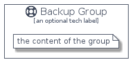

# Backup


```text
homecloud-2/Brand/Backup
```

```text
include('homecloud-2/Brand/Backup')
```


| Illustration | Backup | BackupCard | BackupGroup |
| :---: | :---: | :---: | :---: |
|  |  |  |  |


## Backup

### Load remotely
```plantuml
@startuml
' configures the library
!global $LIB_BASE_LOCATION="https://github.com/tmorin/plantuml-libs/distribution"

' loads the library's bootstrap
!include $LIB_BASE_LOCATION/bootstrap.puml

' loads the package bootstrap
include('homecloud-2/bootstrap')

' loads the Item which embeds the element Backup
include('homecloud-2/Brand/Backup')

' renders the element
Backup('Backup', 'Backup', 'an optional tech label')
@enduml
```

### Load locally
```plantuml
@startuml
' configures the library
!global $INCLUSION_MODE="local"
!global $LIB_BASE_LOCATION="../.."

' loads the library's bootstrap
!include $LIB_BASE_LOCATION/bootstrap.puml

' loads the package bootstrap
include('homecloud-2/bootstrap')

' loads the Item which embeds the element Backup
include('homecloud-2/Brand/Backup')

' renders the element
Backup('Backup', 'Backup', 'an optional tech label')
@enduml
```

## BackupCard

### Load remotely
```plantuml
@startuml
' configures the library
!global $LIB_BASE_LOCATION="https://github.com/tmorin/plantuml-libs/distribution"

' loads the library's bootstrap
!include $LIB_BASE_LOCATION/bootstrap.puml

' loads the package bootstrap
include('homecloud-2/bootstrap')

' loads the Item which embeds the element BackupCard
include('homecloud-2/Brand/Backup')

' renders the element
BackupCard('BackupCard', 'Backup Card', 'an optional description')
@enduml
```

### Load locally
```plantuml
@startuml
' configures the library
!global $INCLUSION_MODE="local"
!global $LIB_BASE_LOCATION="../.."

' loads the library's bootstrap
!include $LIB_BASE_LOCATION/bootstrap.puml

' loads the package bootstrap
include('homecloud-2/bootstrap')

' loads the Item which embeds the element BackupCard
include('homecloud-2/Brand/Backup')

' renders the element
BackupCard('BackupCard', 'Backup Card', 'an optional description')
@enduml
```

## BackupGroup

### Load remotely
```plantuml
@startuml
' configures the library
!global $LIB_BASE_LOCATION="https://github.com/tmorin/plantuml-libs/distribution"

' loads the library's bootstrap
!include $LIB_BASE_LOCATION/bootstrap.puml

' loads the package bootstrap
include('homecloud-2/bootstrap')

' loads the Item which embeds the element BackupGroup
include('homecloud-2/Brand/Backup')

' renders the element
BackupGroup('BackupGroup', 'Backup Group', 'an optional tech label') {
    note as note
        the content of the group
    end note
}
@enduml
```

### Load locally
```plantuml
@startuml
' configures the library
!global $INCLUSION_MODE="local"
!global $LIB_BASE_LOCATION="../.."

' loads the library's bootstrap
!include $LIB_BASE_LOCATION/bootstrap.puml

' loads the package bootstrap
include('homecloud-2/bootstrap')

' loads the Item which embeds the element BackupGroup
include('homecloud-2/Brand/Backup')

' renders the element
BackupGroup('BackupGroup', 'Backup Group', 'an optional tech label') {
    note as note
        the content of the group
    end note
}
@enduml
```

