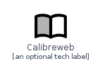
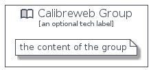

# Calibreweb


```text
homecloud-2/Brand/Calibreweb
```

```text
include('homecloud-2/Brand/Calibreweb')
```


| Illustration | Calibreweb | CalibrewebCard | CalibrewebGroup |
| :---: | :---: | :---: | :---: |
|  |  |  |  |


## Calibreweb

### Load remotely
```plantuml
@startuml
' configures the library
!global $LIB_BASE_LOCATION="https://github.com/tmorin/plantuml-libs/distribution"

' loads the library's bootstrap
!include $LIB_BASE_LOCATION/bootstrap.puml

' loads the package bootstrap
include('homecloud-2/bootstrap')

' loads the Item which embeds the element Calibreweb
include('homecloud-2/Brand/Calibreweb')

' renders the element
Calibreweb('Calibreweb', 'Calibreweb', 'an optional tech label')
@enduml
```

### Load locally
```plantuml
@startuml
' configures the library
!global $INCLUSION_MODE="local"
!global $LIB_BASE_LOCATION="../.."

' loads the library's bootstrap
!include $LIB_BASE_LOCATION/bootstrap.puml

' loads the package bootstrap
include('homecloud-2/bootstrap')

' loads the Item which embeds the element Calibreweb
include('homecloud-2/Brand/Calibreweb')

' renders the element
Calibreweb('Calibreweb', 'Calibreweb', 'an optional tech label')
@enduml
```

## CalibrewebCard

### Load remotely
```plantuml
@startuml
' configures the library
!global $LIB_BASE_LOCATION="https://github.com/tmorin/plantuml-libs/distribution"

' loads the library's bootstrap
!include $LIB_BASE_LOCATION/bootstrap.puml

' loads the package bootstrap
include('homecloud-2/bootstrap')

' loads the Item which embeds the element CalibrewebCard
include('homecloud-2/Brand/Calibreweb')

' renders the element
CalibrewebCard('CalibrewebCard', 'Calibreweb Card', 'an optional description')
@enduml
```

### Load locally
```plantuml
@startuml
' configures the library
!global $INCLUSION_MODE="local"
!global $LIB_BASE_LOCATION="../.."

' loads the library's bootstrap
!include $LIB_BASE_LOCATION/bootstrap.puml

' loads the package bootstrap
include('homecloud-2/bootstrap')

' loads the Item which embeds the element CalibrewebCard
include('homecloud-2/Brand/Calibreweb')

' renders the element
CalibrewebCard('CalibrewebCard', 'Calibreweb Card', 'an optional description')
@enduml
```

## CalibrewebGroup

### Load remotely
```plantuml
@startuml
' configures the library
!global $LIB_BASE_LOCATION="https://github.com/tmorin/plantuml-libs/distribution"

' loads the library's bootstrap
!include $LIB_BASE_LOCATION/bootstrap.puml

' loads the package bootstrap
include('homecloud-2/bootstrap')

' loads the Item which embeds the element CalibrewebGroup
include('homecloud-2/Brand/Calibreweb')

' renders the element
CalibrewebGroup('CalibrewebGroup', 'Calibreweb Group', 'an optional tech label') {
    note as note
        the content of the group
    end note
}
@enduml
```

### Load locally
```plantuml
@startuml
' configures the library
!global $INCLUSION_MODE="local"
!global $LIB_BASE_LOCATION="../.."

' loads the library's bootstrap
!include $LIB_BASE_LOCATION/bootstrap.puml

' loads the package bootstrap
include('homecloud-2/bootstrap')

' loads the Item which embeds the element CalibrewebGroup
include('homecloud-2/Brand/Calibreweb')

' renders the element
CalibrewebGroup('CalibrewebGroup', 'Calibreweb Group', 'an optional tech label') {
    note as note
        the content of the group
    end note
}
@enduml
```

