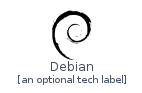
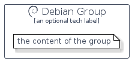

# Debian


```text
homecloud-2/Brand/Debian
```

```text
include('homecloud-2/Brand/Debian')
```


| Illustration | Debian | DebianCard | DebianGroup |
| :---: | :---: | :---: | :---: |
|  |  |  |  |


## Debian

### Load remotely
```plantuml
@startuml
' configures the library
!global $LIB_BASE_LOCATION="https://github.com/tmorin/plantuml-libs/distribution"

' loads the library's bootstrap
!include $LIB_BASE_LOCATION/bootstrap.puml

' loads the package bootstrap
include('homecloud-2/bootstrap')

' loads the Item which embeds the element Debian
include('homecloud-2/Brand/Debian')

' renders the element
Debian('Debian', 'Debian', 'an optional tech label')
@enduml
```

### Load locally
```plantuml
@startuml
' configures the library
!global $INCLUSION_MODE="local"
!global $LIB_BASE_LOCATION="../.."

' loads the library's bootstrap
!include $LIB_BASE_LOCATION/bootstrap.puml

' loads the package bootstrap
include('homecloud-2/bootstrap')

' loads the Item which embeds the element Debian
include('homecloud-2/Brand/Debian')

' renders the element
Debian('Debian', 'Debian', 'an optional tech label')
@enduml
```

## DebianCard

### Load remotely
```plantuml
@startuml
' configures the library
!global $LIB_BASE_LOCATION="https://github.com/tmorin/plantuml-libs/distribution"

' loads the library's bootstrap
!include $LIB_BASE_LOCATION/bootstrap.puml

' loads the package bootstrap
include('homecloud-2/bootstrap')

' loads the Item which embeds the element DebianCard
include('homecloud-2/Brand/Debian')

' renders the element
DebianCard('DebianCard', 'Debian Card', 'an optional description')
@enduml
```

### Load locally
```plantuml
@startuml
' configures the library
!global $INCLUSION_MODE="local"
!global $LIB_BASE_LOCATION="../.."

' loads the library's bootstrap
!include $LIB_BASE_LOCATION/bootstrap.puml

' loads the package bootstrap
include('homecloud-2/bootstrap')

' loads the Item which embeds the element DebianCard
include('homecloud-2/Brand/Debian')

' renders the element
DebianCard('DebianCard', 'Debian Card', 'an optional description')
@enduml
```

## DebianGroup

### Load remotely
```plantuml
@startuml
' configures the library
!global $LIB_BASE_LOCATION="https://github.com/tmorin/plantuml-libs/distribution"

' loads the library's bootstrap
!include $LIB_BASE_LOCATION/bootstrap.puml

' loads the package bootstrap
include('homecloud-2/bootstrap')

' loads the Item which embeds the element DebianGroup
include('homecloud-2/Brand/Debian')

' renders the element
DebianGroup('DebianGroup', 'Debian Group', 'an optional tech label') {
    note as note
        the content of the group
    end note
}
@enduml
```

### Load locally
```plantuml
@startuml
' configures the library
!global $INCLUSION_MODE="local"
!global $LIB_BASE_LOCATION="../.."

' loads the library's bootstrap
!include $LIB_BASE_LOCATION/bootstrap.puml

' loads the package bootstrap
include('homecloud-2/bootstrap')

' loads the Item which embeds the element DebianGroup
include('homecloud-2/Brand/Debian')

' renders the element
DebianGroup('DebianGroup', 'Debian Group', 'an optional tech label') {
    note as note
        the content of the group
    end note
}
@enduml
```

