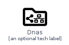
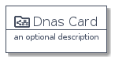
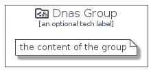

# Dnas


```text
homecloud-2/Brand/Dnas
```

```text
include('homecloud-2/Brand/Dnas')
```


| Illustration | Dnas | DnasCard | DnasGroup |
| :---: | :---: | :---: | :---: |
|  |  |  |  |


## Dnas

### Load remotely
```plantuml
@startuml
' configures the library
!global $LIB_BASE_LOCATION="https://github.com/tmorin/plantuml-libs/distribution"

' loads the library's bootstrap
!include $LIB_BASE_LOCATION/bootstrap.puml

' loads the package bootstrap
include('homecloud-2/bootstrap')

' loads the Item which embeds the element Dnas
include('homecloud-2/Brand/Dnas')

' renders the element
Dnas('Dnas', 'Dnas', 'an optional tech label')
@enduml
```

### Load locally
```plantuml
@startuml
' configures the library
!global $INCLUSION_MODE="local"
!global $LIB_BASE_LOCATION="../.."

' loads the library's bootstrap
!include $LIB_BASE_LOCATION/bootstrap.puml

' loads the package bootstrap
include('homecloud-2/bootstrap')

' loads the Item which embeds the element Dnas
include('homecloud-2/Brand/Dnas')

' renders the element
Dnas('Dnas', 'Dnas', 'an optional tech label')
@enduml
```

## DnasCard

### Load remotely
```plantuml
@startuml
' configures the library
!global $LIB_BASE_LOCATION="https://github.com/tmorin/plantuml-libs/distribution"

' loads the library's bootstrap
!include $LIB_BASE_LOCATION/bootstrap.puml

' loads the package bootstrap
include('homecloud-2/bootstrap')

' loads the Item which embeds the element DnasCard
include('homecloud-2/Brand/Dnas')

' renders the element
DnasCard('DnasCard', 'Dnas Card', 'an optional description')
@enduml
```

### Load locally
```plantuml
@startuml
' configures the library
!global $INCLUSION_MODE="local"
!global $LIB_BASE_LOCATION="../.."

' loads the library's bootstrap
!include $LIB_BASE_LOCATION/bootstrap.puml

' loads the package bootstrap
include('homecloud-2/bootstrap')

' loads the Item which embeds the element DnasCard
include('homecloud-2/Brand/Dnas')

' renders the element
DnasCard('DnasCard', 'Dnas Card', 'an optional description')
@enduml
```

## DnasGroup

### Load remotely
```plantuml
@startuml
' configures the library
!global $LIB_BASE_LOCATION="https://github.com/tmorin/plantuml-libs/distribution"

' loads the library's bootstrap
!include $LIB_BASE_LOCATION/bootstrap.puml

' loads the package bootstrap
include('homecloud-2/bootstrap')

' loads the Item which embeds the element DnasGroup
include('homecloud-2/Brand/Dnas')

' renders the element
DnasGroup('DnasGroup', 'Dnas Group', 'an optional tech label') {
    note as note
        the content of the group
    end note
}
@enduml
```

### Load locally
```plantuml
@startuml
' configures the library
!global $INCLUSION_MODE="local"
!global $LIB_BASE_LOCATION="../.."

' loads the library's bootstrap
!include $LIB_BASE_LOCATION/bootstrap.puml

' loads the package bootstrap
include('homecloud-2/bootstrap')

' loads the Item which embeds the element DnasGroup
include('homecloud-2/Brand/Dnas')

' renders the element
DnasGroup('DnasGroup', 'Dnas Group', 'an optional tech label') {
    note as note
        the content of the group
    end note
}
@enduml
```

