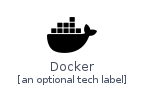
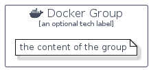

# Docker


```text
homecloud-2/Brand/Docker
```

```text
include('homecloud-2/Brand/Docker')
```


| Illustration | Docker | DockerCard | DockerGroup |
| :---: | :---: | :---: | :---: |
|  |  |  |  |


## Sprites
The item provides the following sriptes:

- `<$DockerXs>`
- `<$DockerSm>`
- `<$DockerMd>`
- `<$DockerLg>`


## Docker

### Load remotely
```plantuml
@startuml
' configures the library
!global $LIB_BASE_LOCATION="https://raw.githubusercontent.com/tmorin/plantuml-libs/master/distribution"

' loads the library's bootstrap
!include $LIB_BASE_LOCATION/bootstrap.puml

' loads the package bootstrap
include('homecloud-2/bootstrap')

' loads the Item which embeds the element Docker
include('homecloud-2/Brand/Docker')

' renders the element
Docker('Docker', 'Docker', 'an optional tech label', 'an optional description')
@enduml
```

### Load locally
```plantuml
@startuml
' configures the library
!global $INCLUSION_MODE="local"
!global $LIB_BASE_LOCATION="../.."

' loads the library's bootstrap
!include $LIB_BASE_LOCATION/bootstrap.puml

' loads the package bootstrap
include('homecloud-2/bootstrap')

' loads the Item which embeds the element Docker
include('homecloud-2/Brand/Docker')

' renders the element
Docker('Docker', 'Docker', 'an optional tech label', 'an optional description')
@enduml
```

## DockerCard

### Load remotely
```plantuml
@startuml
' configures the library
!global $LIB_BASE_LOCATION="https://raw.githubusercontent.com/tmorin/plantuml-libs/master/distribution"

' loads the library's bootstrap
!include $LIB_BASE_LOCATION/bootstrap.puml

' loads the package bootstrap
include('homecloud-2/bootstrap')

' loads the Item which embeds the element DockerCard
include('homecloud-2/Brand/Docker')

' renders the element
DockerCard('DockerCard', 'Docker Card', 'an optional description')
@enduml
```

### Load locally
```plantuml
@startuml
' configures the library
!global $INCLUSION_MODE="local"
!global $LIB_BASE_LOCATION="../.."

' loads the library's bootstrap
!include $LIB_BASE_LOCATION/bootstrap.puml

' loads the package bootstrap
include('homecloud-2/bootstrap')

' loads the Item which embeds the element DockerCard
include('homecloud-2/Brand/Docker')

' renders the element
DockerCard('DockerCard', 'Docker Card', 'an optional description')
@enduml
```

## DockerGroup

### Load remotely
```plantuml
@startuml
' configures the library
!global $LIB_BASE_LOCATION="https://raw.githubusercontent.com/tmorin/plantuml-libs/master/distribution"

' loads the library's bootstrap
!include $LIB_BASE_LOCATION/bootstrap.puml

' loads the package bootstrap
include('homecloud-2/bootstrap')

' loads the Item which embeds the element DockerGroup
include('homecloud-2/Brand/Docker')

' renders the element
DockerGroup('DockerGroup', 'Docker Group', 'an optional tech label') {
    note as note
        the content of the group
    end note
}
@enduml
```

### Load locally
```plantuml
@startuml
' configures the library
!global $INCLUSION_MODE="local"
!global $LIB_BASE_LOCATION="../.."

' loads the library's bootstrap
!include $LIB_BASE_LOCATION/bootstrap.puml

' loads the package bootstrap
include('homecloud-2/bootstrap')

' loads the Item which embeds the element DockerGroup
include('homecloud-2/Brand/Docker')

' renders the element
DockerGroup('DockerGroup', 'Docker Group', 'an optional tech label') {
    note as note
        the content of the group
    end note
}
@enduml
```

