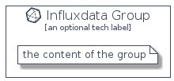

# Influxdata


```text
homecloud-2/Brand/Influxdata
```

```text
include('homecloud-2/Brand/Influxdata')
```


| Illustration | Influxdata | InfluxdataCard | InfluxdataGroup |
| :---: | :---: | :---: | :---: |
|  |  |  |  |


## Sprites
The item provides the following sriptes:

- `<$InfluxdataXs>`
- `<$InfluxdataSm>`
- `<$InfluxdataMd>`
- `<$InfluxdataLg>`


## Influxdata

### Load remotely
```plantuml
@startuml
' configures the library
!global $LIB_BASE_LOCATION="https://raw.githubusercontent.com/tmorin/plantuml-libs/master/distribution"

' loads the library's bootstrap
!include $LIB_BASE_LOCATION/bootstrap.puml

' loads the package bootstrap
include('homecloud-2/bootstrap')

' loads the Item which embeds the element Influxdata
include('homecloud-2/Brand/Influxdata')

' renders the element
Influxdata('Influxdata', 'Influxdata', 'an optional tech label', 'an optional description')
@enduml
```

### Load locally
```plantuml
@startuml
' configures the library
!global $INCLUSION_MODE="local"
!global $LIB_BASE_LOCATION="../.."

' loads the library's bootstrap
!include $LIB_BASE_LOCATION/bootstrap.puml

' loads the package bootstrap
include('homecloud-2/bootstrap')

' loads the Item which embeds the element Influxdata
include('homecloud-2/Brand/Influxdata')

' renders the element
Influxdata('Influxdata', 'Influxdata', 'an optional tech label', 'an optional description')
@enduml
```

## InfluxdataCard

### Load remotely
```plantuml
@startuml
' configures the library
!global $LIB_BASE_LOCATION="https://raw.githubusercontent.com/tmorin/plantuml-libs/master/distribution"

' loads the library's bootstrap
!include $LIB_BASE_LOCATION/bootstrap.puml

' loads the package bootstrap
include('homecloud-2/bootstrap')

' loads the Item which embeds the element InfluxdataCard
include('homecloud-2/Brand/Influxdata')

' renders the element
InfluxdataCard('InfluxdataCard', 'Influxdata Card', 'an optional description')
@enduml
```

### Load locally
```plantuml
@startuml
' configures the library
!global $INCLUSION_MODE="local"
!global $LIB_BASE_LOCATION="../.."

' loads the library's bootstrap
!include $LIB_BASE_LOCATION/bootstrap.puml

' loads the package bootstrap
include('homecloud-2/bootstrap')

' loads the Item which embeds the element InfluxdataCard
include('homecloud-2/Brand/Influxdata')

' renders the element
InfluxdataCard('InfluxdataCard', 'Influxdata Card', 'an optional description')
@enduml
```

## InfluxdataGroup

### Load remotely
```plantuml
@startuml
' configures the library
!global $LIB_BASE_LOCATION="https://raw.githubusercontent.com/tmorin/plantuml-libs/master/distribution"

' loads the library's bootstrap
!include $LIB_BASE_LOCATION/bootstrap.puml

' loads the package bootstrap
include('homecloud-2/bootstrap')

' loads the Item which embeds the element InfluxdataGroup
include('homecloud-2/Brand/Influxdata')

' renders the element
InfluxdataGroup('InfluxdataGroup', 'Influxdata Group', 'an optional tech label') {
    note as note
        the content of the group
    end note
}
@enduml
```

### Load locally
```plantuml
@startuml
' configures the library
!global $INCLUSION_MODE="local"
!global $LIB_BASE_LOCATION="../.."

' loads the library's bootstrap
!include $LIB_BASE_LOCATION/bootstrap.puml

' loads the package bootstrap
include('homecloud-2/bootstrap')

' loads the Item which embeds the element InfluxdataGroup
include('homecloud-2/Brand/Influxdata')

' renders the element
InfluxdataGroup('InfluxdataGroup', 'Influxdata Group', 'an optional tech label') {
    note as note
        the content of the group
    end note
}
@enduml
```

