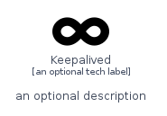
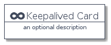
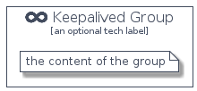

# Keepalived


```text
homecloud-2/Brand/Keepalived
```

```text
include('homecloud-2/Brand/Keepalived')
```


| Illustration | Keepalived | KeepalivedCard | KeepalivedGroup |
| :---: | :---: | :---: | :---: |
|  |  |  |  |


## Keepalived

### Load remotely
```plantuml
@startuml
' configures the library
!global $LIB_BASE_LOCATION="https://raw.githubusercontent.com/tmorin/plantuml-libs/master/distribution"

' loads the library's bootstrap
!include $LIB_BASE_LOCATION/bootstrap.puml

' loads the package bootstrap
include('homecloud-2/bootstrap')

' loads the Item which embeds the element Keepalived
include('homecloud-2/Brand/Keepalived')

' renders the element
Keepalived('Keepalived', 'Keepalived', 'an optional tech label')
@enduml
```

### Load locally
```plantuml
@startuml
' configures the library
!global $INCLUSION_MODE="local"
!global $LIB_BASE_LOCATION="../.."

' loads the library's bootstrap
!include $LIB_BASE_LOCATION/bootstrap.puml

' loads the package bootstrap
include('homecloud-2/bootstrap')

' loads the Item which embeds the element Keepalived
include('homecloud-2/Brand/Keepalived')

' renders the element
Keepalived('Keepalived', 'Keepalived', 'an optional tech label')
@enduml
```

## KeepalivedCard

### Load remotely
```plantuml
@startuml
' configures the library
!global $LIB_BASE_LOCATION="https://raw.githubusercontent.com/tmorin/plantuml-libs/master/distribution"

' loads the library's bootstrap
!include $LIB_BASE_LOCATION/bootstrap.puml

' loads the package bootstrap
include('homecloud-2/bootstrap')

' loads the Item which embeds the element KeepalivedCard
include('homecloud-2/Brand/Keepalived')

' renders the element
KeepalivedCard('KeepalivedCard', 'Keepalived Card', 'an optional description')
@enduml
```

### Load locally
```plantuml
@startuml
' configures the library
!global $INCLUSION_MODE="local"
!global $LIB_BASE_LOCATION="../.."

' loads the library's bootstrap
!include $LIB_BASE_LOCATION/bootstrap.puml

' loads the package bootstrap
include('homecloud-2/bootstrap')

' loads the Item which embeds the element KeepalivedCard
include('homecloud-2/Brand/Keepalived')

' renders the element
KeepalivedCard('KeepalivedCard', 'Keepalived Card', 'an optional description')
@enduml
```

## KeepalivedGroup

### Load remotely
```plantuml
@startuml
' configures the library
!global $LIB_BASE_LOCATION="https://raw.githubusercontent.com/tmorin/plantuml-libs/master/distribution"

' loads the library's bootstrap
!include $LIB_BASE_LOCATION/bootstrap.puml

' loads the package bootstrap
include('homecloud-2/bootstrap')

' loads the Item which embeds the element KeepalivedGroup
include('homecloud-2/Brand/Keepalived')

' renders the element
KeepalivedGroup('KeepalivedGroup', 'Keepalived Group', 'an optional tech label') {
    note as note
        the content of the group
    end note
}
@enduml
```

### Load locally
```plantuml
@startuml
' configures the library
!global $INCLUSION_MODE="local"
!global $LIB_BASE_LOCATION="../.."

' loads the library's bootstrap
!include $LIB_BASE_LOCATION/bootstrap.puml

' loads the package bootstrap
include('homecloud-2/bootstrap')

' loads the Item which embeds the element KeepalivedGroup
include('homecloud-2/Brand/Keepalived')

' renders the element
KeepalivedGroup('KeepalivedGroup', 'Keepalived Group', 'an optional tech label') {
    note as note
        the content of the group
    end note
}
@enduml
```

