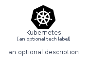

# Kubernetes


```text
homecloud-2/Brand/Kubernetes
```

```text
include('homecloud-2/Brand/Kubernetes')
```


| Illustration | Kubernetes | KubernetesCard | KubernetesGroup |
| :---: | :---: | :---: | :---: |
|  |  |  |  |


## Kubernetes

### Load remotely
```plantuml
@startuml
' configures the library
!global $LIB_BASE_LOCATION="https://github.com/tmorin/plantuml-libs/distribution"

' loads the library's bootstrap
!include $LIB_BASE_LOCATION/bootstrap.puml

' loads the package bootstrap
include('homecloud-2/bootstrap')

' loads the Item which embeds the element Kubernetes
include('homecloud-2/Brand/Kubernetes')

' renders the element
Kubernetes('Kubernetes', 'Kubernetes', 'an optional tech label')
@enduml
```

### Load locally
```plantuml
@startuml
' configures the library
!global $INCLUSION_MODE="local"
!global $LIB_BASE_LOCATION="../.."

' loads the library's bootstrap
!include $LIB_BASE_LOCATION/bootstrap.puml

' loads the package bootstrap
include('homecloud-2/bootstrap')

' loads the Item which embeds the element Kubernetes
include('homecloud-2/Brand/Kubernetes')

' renders the element
Kubernetes('Kubernetes', 'Kubernetes', 'an optional tech label')
@enduml
```

## KubernetesCard

### Load remotely
```plantuml
@startuml
' configures the library
!global $LIB_BASE_LOCATION="https://github.com/tmorin/plantuml-libs/distribution"

' loads the library's bootstrap
!include $LIB_BASE_LOCATION/bootstrap.puml

' loads the package bootstrap
include('homecloud-2/bootstrap')

' loads the Item which embeds the element KubernetesCard
include('homecloud-2/Brand/Kubernetes')

' renders the element
KubernetesCard('KubernetesCard', 'Kubernetes Card', 'an optional description')
@enduml
```

### Load locally
```plantuml
@startuml
' configures the library
!global $INCLUSION_MODE="local"
!global $LIB_BASE_LOCATION="../.."

' loads the library's bootstrap
!include $LIB_BASE_LOCATION/bootstrap.puml

' loads the package bootstrap
include('homecloud-2/bootstrap')

' loads the Item which embeds the element KubernetesCard
include('homecloud-2/Brand/Kubernetes')

' renders the element
KubernetesCard('KubernetesCard', 'Kubernetes Card', 'an optional description')
@enduml
```

## KubernetesGroup

### Load remotely
```plantuml
@startuml
' configures the library
!global $LIB_BASE_LOCATION="https://github.com/tmorin/plantuml-libs/distribution"

' loads the library's bootstrap
!include $LIB_BASE_LOCATION/bootstrap.puml

' loads the package bootstrap
include('homecloud-2/bootstrap')

' loads the Item which embeds the element KubernetesGroup
include('homecloud-2/Brand/Kubernetes')

' renders the element
KubernetesGroup('KubernetesGroup', 'Kubernetes Group', 'an optional tech label') {
    note as note
        the content of the group
    end note
}
@enduml
```

### Load locally
```plantuml
@startuml
' configures the library
!global $INCLUSION_MODE="local"
!global $LIB_BASE_LOCATION="../.."

' loads the library's bootstrap
!include $LIB_BASE_LOCATION/bootstrap.puml

' loads the package bootstrap
include('homecloud-2/bootstrap')

' loads the Item which embeds the element KubernetesGroup
include('homecloud-2/Brand/Kubernetes')

' renders the element
KubernetesGroup('KubernetesGroup', 'Kubernetes Group', 'an optional tech label') {
    note as note
        the content of the group
    end note
}
@enduml
```

