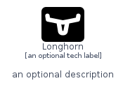
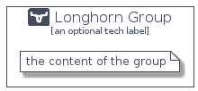

# Longhorn


```text
homecloud-2/Brand/Longhorn
```

```text
include('homecloud-2/Brand/Longhorn')
```


| Illustration | Longhorn | LonghornCard | LonghornGroup |
| :---: | :---: | :---: | :---: |
|  |  |  |  |


## Sprites
The item provides the following sriptes:

- `<$LonghornXs>`
- `<$LonghornSm>`
- `<$LonghornMd>`
- `<$LonghornLg>`


## Longhorn

### Load remotely
```plantuml
@startuml
' configures the library
!global $LIB_BASE_LOCATION="https://raw.githubusercontent.com/tmorin/plantuml-libs/master/distribution"

' loads the library's bootstrap
!include $LIB_BASE_LOCATION/bootstrap.puml

' loads the package bootstrap
include('homecloud-2/bootstrap')

' loads the Item which embeds the element Longhorn
include('homecloud-2/Brand/Longhorn')

' renders the element
Longhorn('Longhorn', 'Longhorn', 'an optional tech label', 'an optional description')
@enduml
```

### Load locally
```plantuml
@startuml
' configures the library
!global $INCLUSION_MODE="local"
!global $LIB_BASE_LOCATION="../.."

' loads the library's bootstrap
!include $LIB_BASE_LOCATION/bootstrap.puml

' loads the package bootstrap
include('homecloud-2/bootstrap')

' loads the Item which embeds the element Longhorn
include('homecloud-2/Brand/Longhorn')

' renders the element
Longhorn('Longhorn', 'Longhorn', 'an optional tech label', 'an optional description')
@enduml
```

## LonghornCard

### Load remotely
```plantuml
@startuml
' configures the library
!global $LIB_BASE_LOCATION="https://raw.githubusercontent.com/tmorin/plantuml-libs/master/distribution"

' loads the library's bootstrap
!include $LIB_BASE_LOCATION/bootstrap.puml

' loads the package bootstrap
include('homecloud-2/bootstrap')

' loads the Item which embeds the element LonghornCard
include('homecloud-2/Brand/Longhorn')

' renders the element
LonghornCard('LonghornCard', 'Longhorn Card', 'an optional description')
@enduml
```

### Load locally
```plantuml
@startuml
' configures the library
!global $INCLUSION_MODE="local"
!global $LIB_BASE_LOCATION="../.."

' loads the library's bootstrap
!include $LIB_BASE_LOCATION/bootstrap.puml

' loads the package bootstrap
include('homecloud-2/bootstrap')

' loads the Item which embeds the element LonghornCard
include('homecloud-2/Brand/Longhorn')

' renders the element
LonghornCard('LonghornCard', 'Longhorn Card', 'an optional description')
@enduml
```

## LonghornGroup

### Load remotely
```plantuml
@startuml
' configures the library
!global $LIB_BASE_LOCATION="https://raw.githubusercontent.com/tmorin/plantuml-libs/master/distribution"

' loads the library's bootstrap
!include $LIB_BASE_LOCATION/bootstrap.puml

' loads the package bootstrap
include('homecloud-2/bootstrap')

' loads the Item which embeds the element LonghornGroup
include('homecloud-2/Brand/Longhorn')

' renders the element
LonghornGroup('LonghornGroup', 'Longhorn Group', 'an optional tech label') {
    note as note
        the content of the group
    end note
}
@enduml
```

### Load locally
```plantuml
@startuml
' configures the library
!global $INCLUSION_MODE="local"
!global $LIB_BASE_LOCATION="../.."

' loads the library's bootstrap
!include $LIB_BASE_LOCATION/bootstrap.puml

' loads the package bootstrap
include('homecloud-2/bootstrap')

' loads the Item which embeds the element LonghornGroup
include('homecloud-2/Brand/Longhorn')

' renders the element
LonghornGroup('LonghornGroup', 'Longhorn Group', 'an optional tech label') {
    note as note
        the content of the group
    end note
}
@enduml
```

