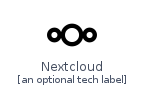
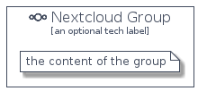

# Nextcloud


```text
homecloud-2/Brand/Nextcloud
```

```text
include('homecloud-2/Brand/Nextcloud')
```


| Illustration | Nextcloud | NextcloudCard | NextcloudGroup |
| :---: | :---: | :---: | :---: |
|  |  |  |  |


## Nextcloud

### Load remotely
```plantuml
@startuml
' configures the library
!global $LIB_BASE_LOCATION="https://raw.githubusercontent.com/tmorin/plantuml-libs/master/distribution"

' loads the library's bootstrap
!include $LIB_BASE_LOCATION/bootstrap.puml

' loads the package bootstrap
include('homecloud-2/bootstrap')

' loads the Item which embeds the element Nextcloud
include('homecloud-2/Brand/Nextcloud')

' renders the element
Nextcloud('Nextcloud', 'Nextcloud', 'an optional tech label', 'an optional description')
@enduml
```

### Load locally
```plantuml
@startuml
' configures the library
!global $INCLUSION_MODE="local"
!global $LIB_BASE_LOCATION="../.."

' loads the library's bootstrap
!include $LIB_BASE_LOCATION/bootstrap.puml

' loads the package bootstrap
include('homecloud-2/bootstrap')

' loads the Item which embeds the element Nextcloud
include('homecloud-2/Brand/Nextcloud')

' renders the element
Nextcloud('Nextcloud', 'Nextcloud', 'an optional tech label', 'an optional description')
@enduml
```

## NextcloudCard

### Load remotely
```plantuml
@startuml
' configures the library
!global $LIB_BASE_LOCATION="https://raw.githubusercontent.com/tmorin/plantuml-libs/master/distribution"

' loads the library's bootstrap
!include $LIB_BASE_LOCATION/bootstrap.puml

' loads the package bootstrap
include('homecloud-2/bootstrap')

' loads the Item which embeds the element NextcloudCard
include('homecloud-2/Brand/Nextcloud')

' renders the element
NextcloudCard('NextcloudCard', 'Nextcloud Card', 'an optional description')
@enduml
```

### Load locally
```plantuml
@startuml
' configures the library
!global $INCLUSION_MODE="local"
!global $LIB_BASE_LOCATION="../.."

' loads the library's bootstrap
!include $LIB_BASE_LOCATION/bootstrap.puml

' loads the package bootstrap
include('homecloud-2/bootstrap')

' loads the Item which embeds the element NextcloudCard
include('homecloud-2/Brand/Nextcloud')

' renders the element
NextcloudCard('NextcloudCard', 'Nextcloud Card', 'an optional description')
@enduml
```

## NextcloudGroup

### Load remotely
```plantuml
@startuml
' configures the library
!global $LIB_BASE_LOCATION="https://raw.githubusercontent.com/tmorin/plantuml-libs/master/distribution"

' loads the library's bootstrap
!include $LIB_BASE_LOCATION/bootstrap.puml

' loads the package bootstrap
include('homecloud-2/bootstrap')

' loads the Item which embeds the element NextcloudGroup
include('homecloud-2/Brand/Nextcloud')

' renders the element
NextcloudGroup('NextcloudGroup', 'Nextcloud Group', 'an optional tech label') {
    note as note
        the content of the group
    end note
}
@enduml
```

### Load locally
```plantuml
@startuml
' configures the library
!global $INCLUSION_MODE="local"
!global $LIB_BASE_LOCATION="../.."

' loads the library's bootstrap
!include $LIB_BASE_LOCATION/bootstrap.puml

' loads the package bootstrap
include('homecloud-2/bootstrap')

' loads the Item which embeds the element NextcloudGroup
include('homecloud-2/Brand/Nextcloud')

' renders the element
NextcloudGroup('NextcloudGroup', 'Nextcloud Group', 'an optional tech label') {
    note as note
        the content of the group
    end note
}
@enduml
```

