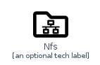
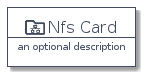
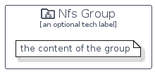

# Nfs


```text
homecloud-2/Brand/Nfs
```

```text
include('homecloud-2/Brand/Nfs')
```


| Illustration | Nfs | NfsCard | NfsGroup |
| :---: | :---: | :---: | :---: |
|  |  |  |  |


## Nfs

### Load remotely
```plantuml
@startuml
' configures the library
!global $LIB_BASE_LOCATION="https://raw.githubusercontent.com/tmorin/plantuml-libs/master/distribution"

' loads the library's bootstrap
!include $LIB_BASE_LOCATION/bootstrap.puml

' loads the package bootstrap
include('homecloud-2/bootstrap')

' loads the Item which embeds the element Nfs
include('homecloud-2/Brand/Nfs')

' renders the element
Nfs('Nfs', 'Nfs', 'an optional tech label', 'an optional description')
@enduml
```

### Load locally
```plantuml
@startuml
' configures the library
!global $INCLUSION_MODE="local"
!global $LIB_BASE_LOCATION="../.."

' loads the library's bootstrap
!include $LIB_BASE_LOCATION/bootstrap.puml

' loads the package bootstrap
include('homecloud-2/bootstrap')

' loads the Item which embeds the element Nfs
include('homecloud-2/Brand/Nfs')

' renders the element
Nfs('Nfs', 'Nfs', 'an optional tech label', 'an optional description')
@enduml
```

## NfsCard

### Load remotely
```plantuml
@startuml
' configures the library
!global $LIB_BASE_LOCATION="https://raw.githubusercontent.com/tmorin/plantuml-libs/master/distribution"

' loads the library's bootstrap
!include $LIB_BASE_LOCATION/bootstrap.puml

' loads the package bootstrap
include('homecloud-2/bootstrap')

' loads the Item which embeds the element NfsCard
include('homecloud-2/Brand/Nfs')

' renders the element
NfsCard('NfsCard', 'Nfs Card', 'an optional description')
@enduml
```

### Load locally
```plantuml
@startuml
' configures the library
!global $INCLUSION_MODE="local"
!global $LIB_BASE_LOCATION="../.."

' loads the library's bootstrap
!include $LIB_BASE_LOCATION/bootstrap.puml

' loads the package bootstrap
include('homecloud-2/bootstrap')

' loads the Item which embeds the element NfsCard
include('homecloud-2/Brand/Nfs')

' renders the element
NfsCard('NfsCard', 'Nfs Card', 'an optional description')
@enduml
```

## NfsGroup

### Load remotely
```plantuml
@startuml
' configures the library
!global $LIB_BASE_LOCATION="https://raw.githubusercontent.com/tmorin/plantuml-libs/master/distribution"

' loads the library's bootstrap
!include $LIB_BASE_LOCATION/bootstrap.puml

' loads the package bootstrap
include('homecloud-2/bootstrap')

' loads the Item which embeds the element NfsGroup
include('homecloud-2/Brand/Nfs')

' renders the element
NfsGroup('NfsGroup', 'Nfs Group', 'an optional tech label') {
    note as note
        the content of the group
    end note
}
@enduml
```

### Load locally
```plantuml
@startuml
' configures the library
!global $INCLUSION_MODE="local"
!global $LIB_BASE_LOCATION="../.."

' loads the library's bootstrap
!include $LIB_BASE_LOCATION/bootstrap.puml

' loads the package bootstrap
include('homecloud-2/bootstrap')

' loads the Item which embeds the element NfsGroup
include('homecloud-2/Brand/Nfs')

' renders the element
NfsGroup('NfsGroup', 'Nfs Group', 'an optional tech label') {
    note as note
        the content of the group
    end note
}
@enduml
```

