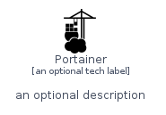
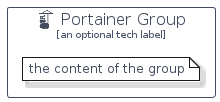

# Portainer


```text
homecloud-2/Brand/Portainer
```

```text
include('homecloud-2/Brand/Portainer')
```


| Illustration | Portainer | PortainerCard | PortainerGroup |
| :---: | :---: | :---: | :---: |
|  |  |  |  |


## Portainer

### Load remotely
```plantuml
@startuml
' configures the library
!global $LIB_BASE_LOCATION="https://raw.githubusercontent.com/tmorin/plantuml-libs/master/distribution"

' loads the library's bootstrap
!include $LIB_BASE_LOCATION/bootstrap.puml

' loads the package bootstrap
include('homecloud-2/bootstrap')

' loads the Item which embeds the element Portainer
include('homecloud-2/Brand/Portainer')

' renders the element
Portainer('Portainer', 'Portainer', 'an optional tech label')
@enduml
```

### Load locally
```plantuml
@startuml
' configures the library
!global $INCLUSION_MODE="local"
!global $LIB_BASE_LOCATION="../.."

' loads the library's bootstrap
!include $LIB_BASE_LOCATION/bootstrap.puml

' loads the package bootstrap
include('homecloud-2/bootstrap')

' loads the Item which embeds the element Portainer
include('homecloud-2/Brand/Portainer')

' renders the element
Portainer('Portainer', 'Portainer', 'an optional tech label')
@enduml
```

## PortainerCard

### Load remotely
```plantuml
@startuml
' configures the library
!global $LIB_BASE_LOCATION="https://raw.githubusercontent.com/tmorin/plantuml-libs/master/distribution"

' loads the library's bootstrap
!include $LIB_BASE_LOCATION/bootstrap.puml

' loads the package bootstrap
include('homecloud-2/bootstrap')

' loads the Item which embeds the element PortainerCard
include('homecloud-2/Brand/Portainer')

' renders the element
PortainerCard('PortainerCard', 'Portainer Card', 'an optional description')
@enduml
```

### Load locally
```plantuml
@startuml
' configures the library
!global $INCLUSION_MODE="local"
!global $LIB_BASE_LOCATION="../.."

' loads the library's bootstrap
!include $LIB_BASE_LOCATION/bootstrap.puml

' loads the package bootstrap
include('homecloud-2/bootstrap')

' loads the Item which embeds the element PortainerCard
include('homecloud-2/Brand/Portainer')

' renders the element
PortainerCard('PortainerCard', 'Portainer Card', 'an optional description')
@enduml
```

## PortainerGroup

### Load remotely
```plantuml
@startuml
' configures the library
!global $LIB_BASE_LOCATION="https://raw.githubusercontent.com/tmorin/plantuml-libs/master/distribution"

' loads the library's bootstrap
!include $LIB_BASE_LOCATION/bootstrap.puml

' loads the package bootstrap
include('homecloud-2/bootstrap')

' loads the Item which embeds the element PortainerGroup
include('homecloud-2/Brand/Portainer')

' renders the element
PortainerGroup('PortainerGroup', 'Portainer Group', 'an optional tech label') {
    note as note
        the content of the group
    end note
}
@enduml
```

### Load locally
```plantuml
@startuml
' configures the library
!global $INCLUSION_MODE="local"
!global $LIB_BASE_LOCATION="../.."

' loads the library's bootstrap
!include $LIB_BASE_LOCATION/bootstrap.puml

' loads the package bootstrap
include('homecloud-2/bootstrap')

' loads the Item which embeds the element PortainerGroup
include('homecloud-2/Brand/Portainer')

' renders the element
PortainerGroup('PortainerGroup', 'Portainer Group', 'an optional tech label') {
    note as note
        the content of the group
    end note
}
@enduml
```

