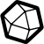

# Brand

The module contains 17 items.

| |Name|
|:---:|---|
|  | [homecloud-2/Brand/Backup](../../homecloud-2/Brand/Backup.md) |
|  | [homecloud-2/Brand/Calibreweb](../../homecloud-2/Brand/Calibreweb.md) |
|  | [homecloud-2/Brand/Ceph](../../homecloud-2/Brand/Ceph.md) |
|  | [homecloud-2/Brand/Debian](../../homecloud-2/Brand/Debian.md) |
|  | [homecloud-2/Brand/Dnas](../../homecloud-2/Brand/Dnas.md) |
|  | [homecloud-2/Brand/Docker](../../homecloud-2/Brand/Docker.md) |
|  | [homecloud-2/Brand/Influxdata](../../homecloud-2/Brand/Influxdata.md) |
|  | [homecloud-2/Brand/Keepalived](../../homecloud-2/Brand/Keepalived.md) |
|  | [homecloud-2/Brand/Kubernetes](../../homecloud-2/Brand/Kubernetes.md) |
|  | [homecloud-2/Brand/Longhorn](../../homecloud-2/Brand/Longhorn.md) |
|  | [homecloud-2/Brand/Nextcloud](../../homecloud-2/Brand/Nextcloud.md) |
|  | [homecloud-2/Brand/Nfs](../../homecloud-2/Brand/Nfs.md) |
|  | [homecloud-2/Brand/Portainer](../../homecloud-2/Brand/Portainer.md) |
|  | [homecloud-2/Brand/Samba](../../homecloud-2/Brand/Samba.md) |
|  | [homecloud-2/Brand/Syncthing](../../homecloud-2/Brand/Syncthing.md) |
|  | [homecloud-2/Brand/Traefik](../../homecloud-2/Brand/Traefik.md) |
|  | [homecloud-2/Brand/Ubuntu](../../homecloud-2/Brand/Ubuntu.md) |

