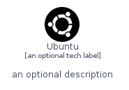
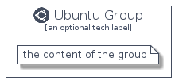

# Ubuntu


```text
homecloud-2/Brand/Ubuntu
```

```text
include('homecloud-2/Brand/Ubuntu')
```


| Illustration | Ubuntu | UbuntuCard | UbuntuGroup |
| :---: | :---: | :---: | :---: |
|  |  |  |  |


## Ubuntu

### Load remotely
```plantuml
@startuml
' configures the library
!global $LIB_BASE_LOCATION="https://github.com/tmorin/plantuml-libs/distribution"

' loads the library's bootstrap
!include $LIB_BASE_LOCATION/bootstrap.puml

' loads the package bootstrap
include('homecloud-2/bootstrap')

' loads the Item which embeds the element Ubuntu
include('homecloud-2/Brand/Ubuntu')

' renders the element
Ubuntu('Ubuntu', 'Ubuntu', 'an optional tech label')
@enduml
```

### Load locally
```plantuml
@startuml
' configures the library
!global $INCLUSION_MODE="local"
!global $LIB_BASE_LOCATION="../.."

' loads the library's bootstrap
!include $LIB_BASE_LOCATION/bootstrap.puml

' loads the package bootstrap
include('homecloud-2/bootstrap')

' loads the Item which embeds the element Ubuntu
include('homecloud-2/Brand/Ubuntu')

' renders the element
Ubuntu('Ubuntu', 'Ubuntu', 'an optional tech label')
@enduml
```

## UbuntuCard

### Load remotely
```plantuml
@startuml
' configures the library
!global $LIB_BASE_LOCATION="https://github.com/tmorin/plantuml-libs/distribution"

' loads the library's bootstrap
!include $LIB_BASE_LOCATION/bootstrap.puml

' loads the package bootstrap
include('homecloud-2/bootstrap')

' loads the Item which embeds the element UbuntuCard
include('homecloud-2/Brand/Ubuntu')

' renders the element
UbuntuCard('UbuntuCard', 'Ubuntu Card', 'an optional description')
@enduml
```

### Load locally
```plantuml
@startuml
' configures the library
!global $INCLUSION_MODE="local"
!global $LIB_BASE_LOCATION="../.."

' loads the library's bootstrap
!include $LIB_BASE_LOCATION/bootstrap.puml

' loads the package bootstrap
include('homecloud-2/bootstrap')

' loads the Item which embeds the element UbuntuCard
include('homecloud-2/Brand/Ubuntu')

' renders the element
UbuntuCard('UbuntuCard', 'Ubuntu Card', 'an optional description')
@enduml
```

## UbuntuGroup

### Load remotely
```plantuml
@startuml
' configures the library
!global $LIB_BASE_LOCATION="https://github.com/tmorin/plantuml-libs/distribution"

' loads the library's bootstrap
!include $LIB_BASE_LOCATION/bootstrap.puml

' loads the package bootstrap
include('homecloud-2/bootstrap')

' loads the Item which embeds the element UbuntuGroup
include('homecloud-2/Brand/Ubuntu')

' renders the element
UbuntuGroup('UbuntuGroup', 'Ubuntu Group', 'an optional tech label') {
    note as note
        the content of the group
    end note
}
@enduml
```

### Load locally
```plantuml
@startuml
' configures the library
!global $INCLUSION_MODE="local"
!global $LIB_BASE_LOCATION="../.."

' loads the library's bootstrap
!include $LIB_BASE_LOCATION/bootstrap.puml

' loads the package bootstrap
include('homecloud-2/bootstrap')

' loads the Item which embeds the element UbuntuGroup
include('homecloud-2/Brand/Ubuntu')

' renders the element
UbuntuGroup('UbuntuGroup', 'Ubuntu Group', 'an optional tech label') {
    note as note
        the content of the group
    end note
}
@enduml
```

