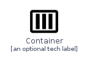
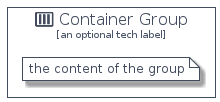

# Container


```text
homecloud-2/Container/Container
```

```text
include('homecloud-2/Container/Container')
```


| Illustration | Container | ContainerCard | ContainerGroup |
| :---: | :---: | :---: | :---: |
|  |  |  |  |


## Container

### Load remotely
```plantuml
@startuml
' configures the library
!global $LIB_BASE_LOCATION="https://github.com/tmorin/plantuml-libs/distribution"

' loads the library's bootstrap
!include $LIB_BASE_LOCATION/bootstrap.puml

' loads the package bootstrap
include('homecloud-2/bootstrap')

' loads the Item which embeds the element Container
include('homecloud-2/Container/Container')

' renders the element
Container('Container', 'Container', 'an optional tech label')
@enduml
```

### Load locally
```plantuml
@startuml
' configures the library
!global $INCLUSION_MODE="local"
!global $LIB_BASE_LOCATION="../.."

' loads the library's bootstrap
!include $LIB_BASE_LOCATION/bootstrap.puml

' loads the package bootstrap
include('homecloud-2/bootstrap')

' loads the Item which embeds the element Container
include('homecloud-2/Container/Container')

' renders the element
Container('Container', 'Container', 'an optional tech label')
@enduml
```

## ContainerCard

### Load remotely
```plantuml
@startuml
' configures the library
!global $LIB_BASE_LOCATION="https://github.com/tmorin/plantuml-libs/distribution"

' loads the library's bootstrap
!include $LIB_BASE_LOCATION/bootstrap.puml

' loads the package bootstrap
include('homecloud-2/bootstrap')

' loads the Item which embeds the element ContainerCard
include('homecloud-2/Container/Container')

' renders the element
ContainerCard('ContainerCard', 'Container Card', 'an optional description')
@enduml
```

### Load locally
```plantuml
@startuml
' configures the library
!global $INCLUSION_MODE="local"
!global $LIB_BASE_LOCATION="../.."

' loads the library's bootstrap
!include $LIB_BASE_LOCATION/bootstrap.puml

' loads the package bootstrap
include('homecloud-2/bootstrap')

' loads the Item which embeds the element ContainerCard
include('homecloud-2/Container/Container')

' renders the element
ContainerCard('ContainerCard', 'Container Card', 'an optional description')
@enduml
```

## ContainerGroup

### Load remotely
```plantuml
@startuml
' configures the library
!global $LIB_BASE_LOCATION="https://github.com/tmorin/plantuml-libs/distribution"

' loads the library's bootstrap
!include $LIB_BASE_LOCATION/bootstrap.puml

' loads the package bootstrap
include('homecloud-2/bootstrap')

' loads the Item which embeds the element ContainerGroup
include('homecloud-2/Container/Container')

' renders the element
ContainerGroup('ContainerGroup', 'Container Group', 'an optional tech label') {
    note as note
        the content of the group
    end note
}
@enduml
```

### Load locally
```plantuml
@startuml
' configures the library
!global $INCLUSION_MODE="local"
!global $LIB_BASE_LOCATION="../.."

' loads the library's bootstrap
!include $LIB_BASE_LOCATION/bootstrap.puml

' loads the package bootstrap
include('homecloud-2/bootstrap')

' loads the Item which embeds the element ContainerGroup
include('homecloud-2/Container/Container')

' renders the element
ContainerGroup('ContainerGroup', 'Container Group', 'an optional tech label') {
    note as note
        the content of the group
    end note
}
@enduml
```

