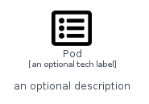
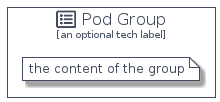

# Pod


```text
homecloud-2/Container/Pod
```

```text
include('homecloud-2/Container/Pod')
```


| Illustration | Pod | PodCard | PodGroup |
| :---: | :---: | :---: | :---: |
|  |  |  |  |


## Pod

### Load remotely
```plantuml
@startuml
' configures the library
!global $LIB_BASE_LOCATION="https://raw.githubusercontent.com/tmorin/plantuml-libs/master/distribution"

' loads the library's bootstrap
!include $LIB_BASE_LOCATION/bootstrap.puml

' loads the package bootstrap
include('homecloud-2/bootstrap')

' loads the Item which embeds the element Pod
include('homecloud-2/Container/Pod')

' renders the element
Pod('Pod', 'Pod', 'an optional tech label', 'an optional description')
@enduml
```

### Load locally
```plantuml
@startuml
' configures the library
!global $INCLUSION_MODE="local"
!global $LIB_BASE_LOCATION="../.."

' loads the library's bootstrap
!include $LIB_BASE_LOCATION/bootstrap.puml

' loads the package bootstrap
include('homecloud-2/bootstrap')

' loads the Item which embeds the element Pod
include('homecloud-2/Container/Pod')

' renders the element
Pod('Pod', 'Pod', 'an optional tech label', 'an optional description')
@enduml
```

## PodCard

### Load remotely
```plantuml
@startuml
' configures the library
!global $LIB_BASE_LOCATION="https://raw.githubusercontent.com/tmorin/plantuml-libs/master/distribution"

' loads the library's bootstrap
!include $LIB_BASE_LOCATION/bootstrap.puml

' loads the package bootstrap
include('homecloud-2/bootstrap')

' loads the Item which embeds the element PodCard
include('homecloud-2/Container/Pod')

' renders the element
PodCard('PodCard', 'Pod Card', 'an optional description')
@enduml
```

### Load locally
```plantuml
@startuml
' configures the library
!global $INCLUSION_MODE="local"
!global $LIB_BASE_LOCATION="../.."

' loads the library's bootstrap
!include $LIB_BASE_LOCATION/bootstrap.puml

' loads the package bootstrap
include('homecloud-2/bootstrap')

' loads the Item which embeds the element PodCard
include('homecloud-2/Container/Pod')

' renders the element
PodCard('PodCard', 'Pod Card', 'an optional description')
@enduml
```

## PodGroup

### Load remotely
```plantuml
@startuml
' configures the library
!global $LIB_BASE_LOCATION="https://raw.githubusercontent.com/tmorin/plantuml-libs/master/distribution"

' loads the library's bootstrap
!include $LIB_BASE_LOCATION/bootstrap.puml

' loads the package bootstrap
include('homecloud-2/bootstrap')

' loads the Item which embeds the element PodGroup
include('homecloud-2/Container/Pod')

' renders the element
PodGroup('PodGroup', 'Pod Group', 'an optional tech label') {
    note as note
        the content of the group
    end note
}
@enduml
```

### Load locally
```plantuml
@startuml
' configures the library
!global $INCLUSION_MODE="local"
!global $LIB_BASE_LOCATION="../.."

' loads the library's bootstrap
!include $LIB_BASE_LOCATION/bootstrap.puml

' loads the package bootstrap
include('homecloud-2/bootstrap')

' loads the Item which embeds the element PodGroup
include('homecloud-2/Container/Pod')

' renders the element
PodGroup('PodGroup', 'Pod Group', 'an optional tech label') {
    note as note
        the content of the group
    end note
}
@enduml
```

