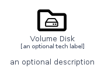

# VolumeDisk


```text
homecloud-2/Container/VolumeDisk
```

```text
include('homecloud-2/Container/VolumeDisk')
```


| Illustration | VolumeDisk | VolumeDiskCard | VolumeDiskGroup |
| :---: | :---: | :---: | :---: |
|  |  |  |  |


## VolumeDisk

### Load remotely
```plantuml
@startuml
' configures the library
!global $LIB_BASE_LOCATION="https://github.com/tmorin/plantuml-libs/distribution"

' loads the library's bootstrap
!include $LIB_BASE_LOCATION/bootstrap.puml

' loads the package bootstrap
include('homecloud-2/bootstrap')

' loads the Item which embeds the element VolumeDisk
include('homecloud-2/Container/VolumeDisk')

' renders the element
VolumeDisk('VolumeDisk', 'Volume Disk', 'an optional tech label')
@enduml
```

### Load locally
```plantuml
@startuml
' configures the library
!global $INCLUSION_MODE="local"
!global $LIB_BASE_LOCATION="../.."

' loads the library's bootstrap
!include $LIB_BASE_LOCATION/bootstrap.puml

' loads the package bootstrap
include('homecloud-2/bootstrap')

' loads the Item which embeds the element VolumeDisk
include('homecloud-2/Container/VolumeDisk')

' renders the element
VolumeDisk('VolumeDisk', 'Volume Disk', 'an optional tech label')
@enduml
```

## VolumeDiskCard

### Load remotely
```plantuml
@startuml
' configures the library
!global $LIB_BASE_LOCATION="https://github.com/tmorin/plantuml-libs/distribution"

' loads the library's bootstrap
!include $LIB_BASE_LOCATION/bootstrap.puml

' loads the package bootstrap
include('homecloud-2/bootstrap')

' loads the Item which embeds the element VolumeDiskCard
include('homecloud-2/Container/VolumeDisk')

' renders the element
VolumeDiskCard('VolumeDiskCard', 'Volume Disk Card', 'an optional description')
@enduml
```

### Load locally
```plantuml
@startuml
' configures the library
!global $INCLUSION_MODE="local"
!global $LIB_BASE_LOCATION="../.."

' loads the library's bootstrap
!include $LIB_BASE_LOCATION/bootstrap.puml

' loads the package bootstrap
include('homecloud-2/bootstrap')

' loads the Item which embeds the element VolumeDiskCard
include('homecloud-2/Container/VolumeDisk')

' renders the element
VolumeDiskCard('VolumeDiskCard', 'Volume Disk Card', 'an optional description')
@enduml
```

## VolumeDiskGroup

### Load remotely
```plantuml
@startuml
' configures the library
!global $LIB_BASE_LOCATION="https://github.com/tmorin/plantuml-libs/distribution"

' loads the library's bootstrap
!include $LIB_BASE_LOCATION/bootstrap.puml

' loads the package bootstrap
include('homecloud-2/bootstrap')

' loads the Item which embeds the element VolumeDiskGroup
include('homecloud-2/Container/VolumeDisk')

' renders the element
VolumeDiskGroup('VolumeDiskGroup', 'Volume Disk Group', 'an optional tech label') {
    note as note
        the content of the group
    end note
}
@enduml
```

### Load locally
```plantuml
@startuml
' configures the library
!global $INCLUSION_MODE="local"
!global $LIB_BASE_LOCATION="../.."

' loads the library's bootstrap
!include $LIB_BASE_LOCATION/bootstrap.puml

' loads the package bootstrap
include('homecloud-2/bootstrap')

' loads the Item which embeds the element VolumeDiskGroup
include('homecloud-2/Container/VolumeDisk')

' renders the element
VolumeDiskGroup('VolumeDiskGroup', 'Volume Disk Group', 'an optional tech label') {
    note as note
        the content of the group
    end note
}
@enduml
```

