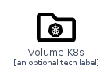
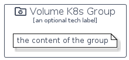

# VolumeK8S


```text
homecloud-2/Container/VolumeK8S
```

```text
include('homecloud-2/Container/VolumeK8S')
```


| Illustration | VolumeK8S | VolumeK8SCard | VolumeK8SGroup |
| :---: | :---: | :---: | :---: |
|  |  |  |  |


## VolumeK8S

### Load remotely
```plantuml
@startuml
' configures the library
!global $LIB_BASE_LOCATION="https://github.com/tmorin/plantuml-libs/distribution"

' loads the library's bootstrap
!include $LIB_BASE_LOCATION/bootstrap.puml

' loads the package bootstrap
include('homecloud-2/bootstrap')

' loads the Item which embeds the element VolumeK8S
include('homecloud-2/Container/VolumeK8S')

' renders the element
VolumeK8S('VolumeK8s', 'Volume K8s', 'an optional tech label')
@enduml
```

### Load locally
```plantuml
@startuml
' configures the library
!global $INCLUSION_MODE="local"
!global $LIB_BASE_LOCATION="../.."

' loads the library's bootstrap
!include $LIB_BASE_LOCATION/bootstrap.puml

' loads the package bootstrap
include('homecloud-2/bootstrap')

' loads the Item which embeds the element VolumeK8S
include('homecloud-2/Container/VolumeK8S')

' renders the element
VolumeK8S('VolumeK8s', 'Volume K8s', 'an optional tech label')
@enduml
```

## VolumeK8SCard

### Load remotely
```plantuml
@startuml
' configures the library
!global $LIB_BASE_LOCATION="https://github.com/tmorin/plantuml-libs/distribution"

' loads the library's bootstrap
!include $LIB_BASE_LOCATION/bootstrap.puml

' loads the package bootstrap
include('homecloud-2/bootstrap')

' loads the Item which embeds the element VolumeK8SCard
include('homecloud-2/Container/VolumeK8S')

' renders the element
VolumeK8SCard('VolumeK8sCard', 'Volume K8s Card', 'an optional description')
@enduml
```

### Load locally
```plantuml
@startuml
' configures the library
!global $INCLUSION_MODE="local"
!global $LIB_BASE_LOCATION="../.."

' loads the library's bootstrap
!include $LIB_BASE_LOCATION/bootstrap.puml

' loads the package bootstrap
include('homecloud-2/bootstrap')

' loads the Item which embeds the element VolumeK8SCard
include('homecloud-2/Container/VolumeK8S')

' renders the element
VolumeK8SCard('VolumeK8sCard', 'Volume K8s Card', 'an optional description')
@enduml
```

## VolumeK8SGroup

### Load remotely
```plantuml
@startuml
' configures the library
!global $LIB_BASE_LOCATION="https://github.com/tmorin/plantuml-libs/distribution"

' loads the library's bootstrap
!include $LIB_BASE_LOCATION/bootstrap.puml

' loads the package bootstrap
include('homecloud-2/bootstrap')

' loads the Item which embeds the element VolumeK8SGroup
include('homecloud-2/Container/VolumeK8S')

' renders the element
VolumeK8SGroup('VolumeK8sGroup', 'Volume K8s Group', 'an optional tech label') {
    note as note
        the content of the group
    end note
}
@enduml
```

### Load locally
```plantuml
@startuml
' configures the library
!global $INCLUSION_MODE="local"
!global $LIB_BASE_LOCATION="../.."

' loads the library's bootstrap
!include $LIB_BASE_LOCATION/bootstrap.puml

' loads the package bootstrap
include('homecloud-2/bootstrap')

' loads the Item which embeds the element VolumeK8SGroup
include('homecloud-2/Container/VolumeK8S')

' renders the element
VolumeK8SGroup('VolumeK8sGroup', 'Volume K8s Group', 'an optional tech label') {
    note as note
        the content of the group
    end note
}
@enduml
```

