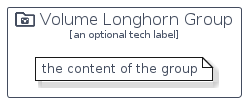

# VolumeLonghorn


```text
homecloud-2/Container/VolumeLonghorn
```

```text
include('homecloud-2/Container/VolumeLonghorn')
```


| Illustration | VolumeLonghorn | VolumeLonghornCard | VolumeLonghornGroup |
| :---: | :---: | :---: | :---: |
|  |  |  |  |


## VolumeLonghorn

### Load remotely
```plantuml
@startuml
' configures the library
!global $LIB_BASE_LOCATION="https://raw.githubusercontent.com/tmorin/plantuml-libs/master/distribution"

' loads the library's bootstrap
!include $LIB_BASE_LOCATION/bootstrap.puml

' loads the package bootstrap
include('homecloud-2/bootstrap')

' loads the Item which embeds the element VolumeLonghorn
include('homecloud-2/Container/VolumeLonghorn')

' renders the element
VolumeLonghorn('VolumeLonghorn', 'Volume Longhorn', 'an optional tech label')
@enduml
```

### Load locally
```plantuml
@startuml
' configures the library
!global $INCLUSION_MODE="local"
!global $LIB_BASE_LOCATION="../.."

' loads the library's bootstrap
!include $LIB_BASE_LOCATION/bootstrap.puml

' loads the package bootstrap
include('homecloud-2/bootstrap')

' loads the Item which embeds the element VolumeLonghorn
include('homecloud-2/Container/VolumeLonghorn')

' renders the element
VolumeLonghorn('VolumeLonghorn', 'Volume Longhorn', 'an optional tech label')
@enduml
```

## VolumeLonghornCard

### Load remotely
```plantuml
@startuml
' configures the library
!global $LIB_BASE_LOCATION="https://raw.githubusercontent.com/tmorin/plantuml-libs/master/distribution"

' loads the library's bootstrap
!include $LIB_BASE_LOCATION/bootstrap.puml

' loads the package bootstrap
include('homecloud-2/bootstrap')

' loads the Item which embeds the element VolumeLonghornCard
include('homecloud-2/Container/VolumeLonghorn')

' renders the element
VolumeLonghornCard('VolumeLonghornCard', 'Volume Longhorn Card', 'an optional description')
@enduml
```

### Load locally
```plantuml
@startuml
' configures the library
!global $INCLUSION_MODE="local"
!global $LIB_BASE_LOCATION="../.."

' loads the library's bootstrap
!include $LIB_BASE_LOCATION/bootstrap.puml

' loads the package bootstrap
include('homecloud-2/bootstrap')

' loads the Item which embeds the element VolumeLonghornCard
include('homecloud-2/Container/VolumeLonghorn')

' renders the element
VolumeLonghornCard('VolumeLonghornCard', 'Volume Longhorn Card', 'an optional description')
@enduml
```

## VolumeLonghornGroup

### Load remotely
```plantuml
@startuml
' configures the library
!global $LIB_BASE_LOCATION="https://raw.githubusercontent.com/tmorin/plantuml-libs/master/distribution"

' loads the library's bootstrap
!include $LIB_BASE_LOCATION/bootstrap.puml

' loads the package bootstrap
include('homecloud-2/bootstrap')

' loads the Item which embeds the element VolumeLonghornGroup
include('homecloud-2/Container/VolumeLonghorn')

' renders the element
VolumeLonghornGroup('VolumeLonghornGroup', 'Volume Longhorn Group', 'an optional tech label') {
    note as note
        the content of the group
    end note
}
@enduml
```

### Load locally
```plantuml
@startuml
' configures the library
!global $INCLUSION_MODE="local"
!global $LIB_BASE_LOCATION="../.."

' loads the library's bootstrap
!include $LIB_BASE_LOCATION/bootstrap.puml

' loads the package bootstrap
include('homecloud-2/bootstrap')

' loads the Item which embeds the element VolumeLonghornGroup
include('homecloud-2/Container/VolumeLonghorn')

' renders the element
VolumeLonghornGroup('VolumeLonghornGroup', 'Volume Longhorn Group', 'an optional tech label') {
    note as note
        the content of the group
    end note
}
@enduml
```

