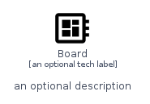
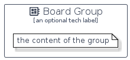

# Board


```text
homecloud-2/Hardware/Board
```

```text
include('homecloud-2/Hardware/Board')
```


| Illustration | Board | BoardCard | BoardGroup |
| :---: | :---: | :---: | :---: |
|  |  |  |  |


## Board

### Load remotely
```plantuml
@startuml
' configures the library
!global $LIB_BASE_LOCATION="https://raw.githubusercontent.com/tmorin/plantuml-libs/master/distribution"

' loads the library's bootstrap
!include $LIB_BASE_LOCATION/bootstrap.puml

' loads the package bootstrap
include('homecloud-2/bootstrap')

' loads the Item which embeds the element Board
include('homecloud-2/Hardware/Board')

' renders the element
Board('Board', 'Board', 'an optional tech label')
@enduml
```

### Load locally
```plantuml
@startuml
' configures the library
!global $INCLUSION_MODE="local"
!global $LIB_BASE_LOCATION="../.."

' loads the library's bootstrap
!include $LIB_BASE_LOCATION/bootstrap.puml

' loads the package bootstrap
include('homecloud-2/bootstrap')

' loads the Item which embeds the element Board
include('homecloud-2/Hardware/Board')

' renders the element
Board('Board', 'Board', 'an optional tech label')
@enduml
```

## BoardCard

### Load remotely
```plantuml
@startuml
' configures the library
!global $LIB_BASE_LOCATION="https://raw.githubusercontent.com/tmorin/plantuml-libs/master/distribution"

' loads the library's bootstrap
!include $LIB_BASE_LOCATION/bootstrap.puml

' loads the package bootstrap
include('homecloud-2/bootstrap')

' loads the Item which embeds the element BoardCard
include('homecloud-2/Hardware/Board')

' renders the element
BoardCard('BoardCard', 'Board Card', 'an optional description')
@enduml
```

### Load locally
```plantuml
@startuml
' configures the library
!global $INCLUSION_MODE="local"
!global $LIB_BASE_LOCATION="../.."

' loads the library's bootstrap
!include $LIB_BASE_LOCATION/bootstrap.puml

' loads the package bootstrap
include('homecloud-2/bootstrap')

' loads the Item which embeds the element BoardCard
include('homecloud-2/Hardware/Board')

' renders the element
BoardCard('BoardCard', 'Board Card', 'an optional description')
@enduml
```

## BoardGroup

### Load remotely
```plantuml
@startuml
' configures the library
!global $LIB_BASE_LOCATION="https://raw.githubusercontent.com/tmorin/plantuml-libs/master/distribution"

' loads the library's bootstrap
!include $LIB_BASE_LOCATION/bootstrap.puml

' loads the package bootstrap
include('homecloud-2/bootstrap')

' loads the Item which embeds the element BoardGroup
include('homecloud-2/Hardware/Board')

' renders the element
BoardGroup('BoardGroup', 'Board Group', 'an optional tech label') {
    note as note
        the content of the group
    end note
}
@enduml
```

### Load locally
```plantuml
@startuml
' configures the library
!global $INCLUSION_MODE="local"
!global $LIB_BASE_LOCATION="../.."

' loads the library's bootstrap
!include $LIB_BASE_LOCATION/bootstrap.puml

' loads the package bootstrap
include('homecloud-2/bootstrap')

' loads the Item which embeds the element BoardGroup
include('homecloud-2/Hardware/Board')

' renders the element
BoardGroup('BoardGroup', 'Board Group', 'an optional tech label') {
    note as note
        the content of the group
    end note
}
@enduml
```

