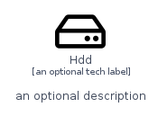
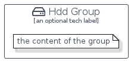

# Hdd


```text
homecloud-2/Hardware/Hdd
```

```text
include('homecloud-2/Hardware/Hdd')
```


| Illustration | Hdd | HddCard | HddGroup |
| :---: | :---: | :---: | :---: |
|  |  |  |  |


## Hdd

### Load remotely
```plantuml
@startuml
' configures the library
!global $LIB_BASE_LOCATION="https://raw.githubusercontent.com/tmorin/plantuml-libs/master/distribution"

' loads the library's bootstrap
!include $LIB_BASE_LOCATION/bootstrap.puml

' loads the package bootstrap
include('homecloud-2/bootstrap')

' loads the Item which embeds the element Hdd
include('homecloud-2/Hardware/Hdd')

' renders the element
Hdd('Hdd', 'Hdd', 'an optional tech label')
@enduml
```

### Load locally
```plantuml
@startuml
' configures the library
!global $INCLUSION_MODE="local"
!global $LIB_BASE_LOCATION="../.."

' loads the library's bootstrap
!include $LIB_BASE_LOCATION/bootstrap.puml

' loads the package bootstrap
include('homecloud-2/bootstrap')

' loads the Item which embeds the element Hdd
include('homecloud-2/Hardware/Hdd')

' renders the element
Hdd('Hdd', 'Hdd', 'an optional tech label')
@enduml
```

## HddCard

### Load remotely
```plantuml
@startuml
' configures the library
!global $LIB_BASE_LOCATION="https://raw.githubusercontent.com/tmorin/plantuml-libs/master/distribution"

' loads the library's bootstrap
!include $LIB_BASE_LOCATION/bootstrap.puml

' loads the package bootstrap
include('homecloud-2/bootstrap')

' loads the Item which embeds the element HddCard
include('homecloud-2/Hardware/Hdd')

' renders the element
HddCard('HddCard', 'Hdd Card', 'an optional description')
@enduml
```

### Load locally
```plantuml
@startuml
' configures the library
!global $INCLUSION_MODE="local"
!global $LIB_BASE_LOCATION="../.."

' loads the library's bootstrap
!include $LIB_BASE_LOCATION/bootstrap.puml

' loads the package bootstrap
include('homecloud-2/bootstrap')

' loads the Item which embeds the element HddCard
include('homecloud-2/Hardware/Hdd')

' renders the element
HddCard('HddCard', 'Hdd Card', 'an optional description')
@enduml
```

## HddGroup

### Load remotely
```plantuml
@startuml
' configures the library
!global $LIB_BASE_LOCATION="https://raw.githubusercontent.com/tmorin/plantuml-libs/master/distribution"

' loads the library's bootstrap
!include $LIB_BASE_LOCATION/bootstrap.puml

' loads the package bootstrap
include('homecloud-2/bootstrap')

' loads the Item which embeds the element HddGroup
include('homecloud-2/Hardware/Hdd')

' renders the element
HddGroup('HddGroup', 'Hdd Group', 'an optional tech label') {
    note as note
        the content of the group
    end note
}
@enduml
```

### Load locally
```plantuml
@startuml
' configures the library
!global $INCLUSION_MODE="local"
!global $LIB_BASE_LOCATION="../.."

' loads the library's bootstrap
!include $LIB_BASE_LOCATION/bootstrap.puml

' loads the package bootstrap
include('homecloud-2/bootstrap')

' loads the Item which embeds the element HddGroup
include('homecloud-2/Hardware/Hdd')

' renders the element
HddGroup('HddGroup', 'Hdd Group', 'an optional tech label') {
    note as note
        the content of the group
    end note
}
@enduml
```

