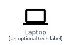
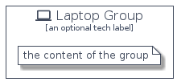

# Laptop


```text
homecloud-2/Hardware/Laptop
```

```text
include('homecloud-2/Hardware/Laptop')
```


| Illustration | Laptop | LaptopCard | LaptopGroup |
| :---: | :---: | :---: | :---: |
|  |  |  |  |


## Laptop

### Load remotely
```plantuml
@startuml
' configures the library
!global $LIB_BASE_LOCATION="https://raw.githubusercontent.com/tmorin/plantuml-libs/master/distribution"

' loads the library's bootstrap
!include $LIB_BASE_LOCATION/bootstrap.puml

' loads the package bootstrap
include('homecloud-2/bootstrap')

' loads the Item which embeds the element Laptop
include('homecloud-2/Hardware/Laptop')

' renders the element
Laptop('Laptop', 'Laptop', 'an optional tech label', 'an optional description')
@enduml
```

### Load locally
```plantuml
@startuml
' configures the library
!global $INCLUSION_MODE="local"
!global $LIB_BASE_LOCATION="../.."

' loads the library's bootstrap
!include $LIB_BASE_LOCATION/bootstrap.puml

' loads the package bootstrap
include('homecloud-2/bootstrap')

' loads the Item which embeds the element Laptop
include('homecloud-2/Hardware/Laptop')

' renders the element
Laptop('Laptop', 'Laptop', 'an optional tech label', 'an optional description')
@enduml
```

## LaptopCard

### Load remotely
```plantuml
@startuml
' configures the library
!global $LIB_BASE_LOCATION="https://raw.githubusercontent.com/tmorin/plantuml-libs/master/distribution"

' loads the library's bootstrap
!include $LIB_BASE_LOCATION/bootstrap.puml

' loads the package bootstrap
include('homecloud-2/bootstrap')

' loads the Item which embeds the element LaptopCard
include('homecloud-2/Hardware/Laptop')

' renders the element
LaptopCard('LaptopCard', 'Laptop Card', 'an optional description')
@enduml
```

### Load locally
```plantuml
@startuml
' configures the library
!global $INCLUSION_MODE="local"
!global $LIB_BASE_LOCATION="../.."

' loads the library's bootstrap
!include $LIB_BASE_LOCATION/bootstrap.puml

' loads the package bootstrap
include('homecloud-2/bootstrap')

' loads the Item which embeds the element LaptopCard
include('homecloud-2/Hardware/Laptop')

' renders the element
LaptopCard('LaptopCard', 'Laptop Card', 'an optional description')
@enduml
```

## LaptopGroup

### Load remotely
```plantuml
@startuml
' configures the library
!global $LIB_BASE_LOCATION="https://raw.githubusercontent.com/tmorin/plantuml-libs/master/distribution"

' loads the library's bootstrap
!include $LIB_BASE_LOCATION/bootstrap.puml

' loads the package bootstrap
include('homecloud-2/bootstrap')

' loads the Item which embeds the element LaptopGroup
include('homecloud-2/Hardware/Laptop')

' renders the element
LaptopGroup('LaptopGroup', 'Laptop Group', 'an optional tech label') {
    note as note
        the content of the group
    end note
}
@enduml
```

### Load locally
```plantuml
@startuml
' configures the library
!global $INCLUSION_MODE="local"
!global $LIB_BASE_LOCATION="../.."

' loads the library's bootstrap
!include $LIB_BASE_LOCATION/bootstrap.puml

' loads the package bootstrap
include('homecloud-2/bootstrap')

' loads the Item which embeds the element LaptopGroup
include('homecloud-2/Hardware/Laptop')

' renders the element
LaptopGroup('LaptopGroup', 'Laptop Group', 'an optional tech label') {
    note as note
        the content of the group
    end note
}
@enduml
```

