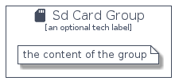

# SdCard


```text
homecloud-2/Hardware/SdCard
```

```text
include('homecloud-2/Hardware/SdCard')
```


| Illustration | SdCard | SdCardCard | SdCardGroup |
| :---: | :---: | :---: | :---: |
|  |  |  |  |


## SdCard

### Load remotely
```plantuml
@startuml
' configures the library
!global $LIB_BASE_LOCATION="https://raw.githubusercontent.com/tmorin/plantuml-libs/master/distribution"

' loads the library's bootstrap
!include $LIB_BASE_LOCATION/bootstrap.puml

' loads the package bootstrap
include('homecloud-2/bootstrap')

' loads the Item which embeds the element SdCard
include('homecloud-2/Hardware/SdCard')

' renders the element
SdCard('SdCard', 'Sd Card', 'an optional tech label', 'an optional description')
@enduml
```

### Load locally
```plantuml
@startuml
' configures the library
!global $INCLUSION_MODE="local"
!global $LIB_BASE_LOCATION="../.."

' loads the library's bootstrap
!include $LIB_BASE_LOCATION/bootstrap.puml

' loads the package bootstrap
include('homecloud-2/bootstrap')

' loads the Item which embeds the element SdCard
include('homecloud-2/Hardware/SdCard')

' renders the element
SdCard('SdCard', 'Sd Card', 'an optional tech label', 'an optional description')
@enduml
```

## SdCardCard

### Load remotely
```plantuml
@startuml
' configures the library
!global $LIB_BASE_LOCATION="https://raw.githubusercontent.com/tmorin/plantuml-libs/master/distribution"

' loads the library's bootstrap
!include $LIB_BASE_LOCATION/bootstrap.puml

' loads the package bootstrap
include('homecloud-2/bootstrap')

' loads the Item which embeds the element SdCardCard
include('homecloud-2/Hardware/SdCard')

' renders the element
SdCardCard('SdCardCard', 'Sd Card Card', 'an optional description')
@enduml
```

### Load locally
```plantuml
@startuml
' configures the library
!global $INCLUSION_MODE="local"
!global $LIB_BASE_LOCATION="../.."

' loads the library's bootstrap
!include $LIB_BASE_LOCATION/bootstrap.puml

' loads the package bootstrap
include('homecloud-2/bootstrap')

' loads the Item which embeds the element SdCardCard
include('homecloud-2/Hardware/SdCard')

' renders the element
SdCardCard('SdCardCard', 'Sd Card Card', 'an optional description')
@enduml
```

## SdCardGroup

### Load remotely
```plantuml
@startuml
' configures the library
!global $LIB_BASE_LOCATION="https://raw.githubusercontent.com/tmorin/plantuml-libs/master/distribution"

' loads the library's bootstrap
!include $LIB_BASE_LOCATION/bootstrap.puml

' loads the package bootstrap
include('homecloud-2/bootstrap')

' loads the Item which embeds the element SdCardGroup
include('homecloud-2/Hardware/SdCard')

' renders the element
SdCardGroup('SdCardGroup', 'Sd Card Group', 'an optional tech label') {
    note as note
        the content of the group
    end note
}
@enduml
```

### Load locally
```plantuml
@startuml
' configures the library
!global $INCLUSION_MODE="local"
!global $LIB_BASE_LOCATION="../.."

' loads the library's bootstrap
!include $LIB_BASE_LOCATION/bootstrap.puml

' loads the package bootstrap
include('homecloud-2/bootstrap')

' loads the Item which embeds the element SdCardGroup
include('homecloud-2/Hardware/SdCard')

' renders the element
SdCardGroup('SdCardGroup', 'Sd Card Group', 'an optional tech label') {
    note as note
        the content of the group
    end note
}
@enduml
```

