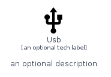
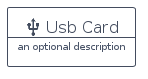
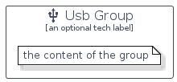

# Usb


```text
homecloud-2/Hardware/Usb
```

```text
include('homecloud-2/Hardware/Usb')
```


| Illustration | Usb | UsbCard | UsbGroup |
| :---: | :---: | :---: | :---: |
|  |  |  |  |


## Usb

### Load remotely
```plantuml
@startuml
' configures the library
!global $LIB_BASE_LOCATION="https://raw.githubusercontent.com/tmorin/plantuml-libs/master/distribution"

' loads the library's bootstrap
!include $LIB_BASE_LOCATION/bootstrap.puml

' loads the package bootstrap
include('homecloud-2/bootstrap')

' loads the Item which embeds the element Usb
include('homecloud-2/Hardware/Usb')

' renders the element
Usb('Usb', 'Usb', 'an optional tech label')
@enduml
```

### Load locally
```plantuml
@startuml
' configures the library
!global $INCLUSION_MODE="local"
!global $LIB_BASE_LOCATION="../.."

' loads the library's bootstrap
!include $LIB_BASE_LOCATION/bootstrap.puml

' loads the package bootstrap
include('homecloud-2/bootstrap')

' loads the Item which embeds the element Usb
include('homecloud-2/Hardware/Usb')

' renders the element
Usb('Usb', 'Usb', 'an optional tech label')
@enduml
```

## UsbCard

### Load remotely
```plantuml
@startuml
' configures the library
!global $LIB_BASE_LOCATION="https://raw.githubusercontent.com/tmorin/plantuml-libs/master/distribution"

' loads the library's bootstrap
!include $LIB_BASE_LOCATION/bootstrap.puml

' loads the package bootstrap
include('homecloud-2/bootstrap')

' loads the Item which embeds the element UsbCard
include('homecloud-2/Hardware/Usb')

' renders the element
UsbCard('UsbCard', 'Usb Card', 'an optional description')
@enduml
```

### Load locally
```plantuml
@startuml
' configures the library
!global $INCLUSION_MODE="local"
!global $LIB_BASE_LOCATION="../.."

' loads the library's bootstrap
!include $LIB_BASE_LOCATION/bootstrap.puml

' loads the package bootstrap
include('homecloud-2/bootstrap')

' loads the Item which embeds the element UsbCard
include('homecloud-2/Hardware/Usb')

' renders the element
UsbCard('UsbCard', 'Usb Card', 'an optional description')
@enduml
```

## UsbGroup

### Load remotely
```plantuml
@startuml
' configures the library
!global $LIB_BASE_LOCATION="https://raw.githubusercontent.com/tmorin/plantuml-libs/master/distribution"

' loads the library's bootstrap
!include $LIB_BASE_LOCATION/bootstrap.puml

' loads the package bootstrap
include('homecloud-2/bootstrap')

' loads the Item which embeds the element UsbGroup
include('homecloud-2/Hardware/Usb')

' renders the element
UsbGroup('UsbGroup', 'Usb Group', 'an optional tech label') {
    note as note
        the content of the group
    end note
}
@enduml
```

### Load locally
```plantuml
@startuml
' configures the library
!global $INCLUSION_MODE="local"
!global $LIB_BASE_LOCATION="../.."

' loads the library's bootstrap
!include $LIB_BASE_LOCATION/bootstrap.puml

' loads the package bootstrap
include('homecloud-2/bootstrap')

' loads the Item which embeds the element UsbGroup
include('homecloud-2/Hardware/Usb')

' renders the element
UsbGroup('UsbGroup', 'Usb Group', 'an optional tech label') {
    note as note
        the content of the group
    end note
}
@enduml
```

