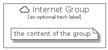

# Internet


```text
homecloud-2/Network/Internet
```

```text
include('homecloud-2/Network/Internet')
```


| Illustration | Internet | InternetCard | InternetGroup |
| :---: | :---: | :---: | :---: |
|  |  |  |  |


## Internet

### Load remotely
```plantuml
@startuml
' configures the library
!global $LIB_BASE_LOCATION="https://raw.githubusercontent.com/tmorin/plantuml-libs/master/distribution"

' loads the library's bootstrap
!include $LIB_BASE_LOCATION/bootstrap.puml

' loads the package bootstrap
include('homecloud-2/bootstrap')

' loads the Item which embeds the element Internet
include('homecloud-2/Network/Internet')

' renders the element
Internet('Internet', 'Internet', 'an optional tech label', 'an optional description')
@enduml
```

### Load locally
```plantuml
@startuml
' configures the library
!global $INCLUSION_MODE="local"
!global $LIB_BASE_LOCATION="../.."

' loads the library's bootstrap
!include $LIB_BASE_LOCATION/bootstrap.puml

' loads the package bootstrap
include('homecloud-2/bootstrap')

' loads the Item which embeds the element Internet
include('homecloud-2/Network/Internet')

' renders the element
Internet('Internet', 'Internet', 'an optional tech label', 'an optional description')
@enduml
```

## InternetCard

### Load remotely
```plantuml
@startuml
' configures the library
!global $LIB_BASE_LOCATION="https://raw.githubusercontent.com/tmorin/plantuml-libs/master/distribution"

' loads the library's bootstrap
!include $LIB_BASE_LOCATION/bootstrap.puml

' loads the package bootstrap
include('homecloud-2/bootstrap')

' loads the Item which embeds the element InternetCard
include('homecloud-2/Network/Internet')

' renders the element
InternetCard('InternetCard', 'Internet Card', 'an optional description')
@enduml
```

### Load locally
```plantuml
@startuml
' configures the library
!global $INCLUSION_MODE="local"
!global $LIB_BASE_LOCATION="../.."

' loads the library's bootstrap
!include $LIB_BASE_LOCATION/bootstrap.puml

' loads the package bootstrap
include('homecloud-2/bootstrap')

' loads the Item which embeds the element InternetCard
include('homecloud-2/Network/Internet')

' renders the element
InternetCard('InternetCard', 'Internet Card', 'an optional description')
@enduml
```

## InternetGroup

### Load remotely
```plantuml
@startuml
' configures the library
!global $LIB_BASE_LOCATION="https://raw.githubusercontent.com/tmorin/plantuml-libs/master/distribution"

' loads the library's bootstrap
!include $LIB_BASE_LOCATION/bootstrap.puml

' loads the package bootstrap
include('homecloud-2/bootstrap')

' loads the Item which embeds the element InternetGroup
include('homecloud-2/Network/Internet')

' renders the element
InternetGroup('InternetGroup', 'Internet Group', 'an optional tech label') {
    note as note
        the content of the group
    end note
}
@enduml
```

### Load locally
```plantuml
@startuml
' configures the library
!global $INCLUSION_MODE="local"
!global $LIB_BASE_LOCATION="../.."

' loads the library's bootstrap
!include $LIB_BASE_LOCATION/bootstrap.puml

' loads the package bootstrap
include('homecloud-2/bootstrap')

' loads the Item which embeds the element InternetGroup
include('homecloud-2/Network/Internet')

' renders the element
InternetGroup('InternetGroup', 'Internet Group', 'an optional tech label') {
    note as note
        the content of the group
    end note
}
@enduml
```

