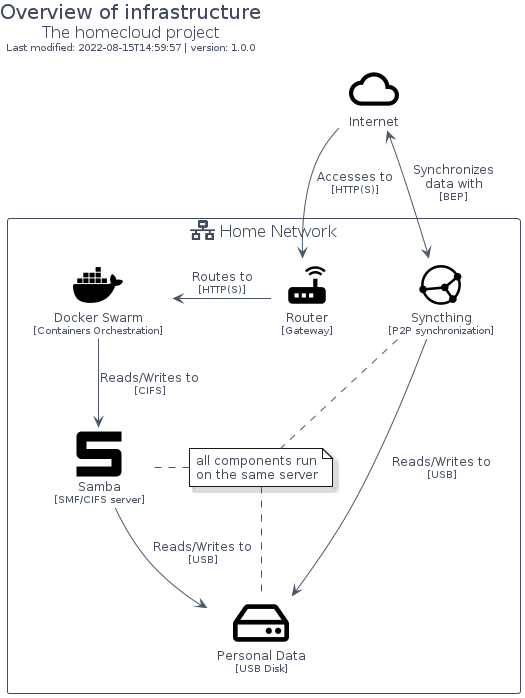

# homecloud-2

## Presentation
This package is used to document the project [homecloud](https://github.com/tmorin/homecloud-ansible).

It implements elements based on :

- [Material Design Icons](https://github.com/google/material-design-icons)
- [Font Awesome](https://fontawesome.com)

Provide the colors and palettes of [Nord Theme](https://www.nordtheme.com).

## Usage

### Bootstrap

The bootstrap may provide PlantUML artifacts like constants, procedures or style statements.

```plantuml
' loads the homecloud-2 bootstrap
include('homecloud-2/bootstrap')
```

### Full inclusion

An additional include can be used to load all items in one shot.

 ```plantuml
' loads the bootstrap of `homecloud-2` and all related items
include('homecloud-2/full')
```

### Single inclusion

Finally, another include can be used to load the library's bootstrap, the package's bootstrap and all items' resources in one `!include` statement.

Include remotely the resources:
```plantuml
' loads the library, the bootstrap of `homecloud-2` and all related items
!include https://raw.githubusercontent.com/tmorin/plantuml-libs/master/distribution/homecloud-2/single.puml
```

Include locally the resources:
```plantuml
' configures the library
!global $INCLUSION_MODE="local"
' loads the library, the bootstrap of `homecloud-2` and all related items
!include <the relative path to the /distribution directory>/homecloud-2/single.puml
```


# Modules

The package provides 4 modules.

- [homecloud-2/Brand](../homecloud-2/Brand/README.md) with 17 items
- [homecloud-2/Container](../homecloud-2/Container/README.md) with 6 items
- [homecloud-2/Hardware](../homecloud-2/Hardware/README.md) with 6 items
- [homecloud-2/Network](../homecloud-2/Network/README.md) with 4 items


# Examples

The package provides 1 examples.

## Simple

<br>
[The source file.](../homecloud-2/simple.puml)


