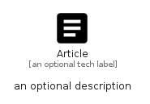

# Article


```text
material-4/Action/Article
```

```text
include('material-4/Action/Article')
```


| Illustration | Article |
| :---: | :---: |
|  |  |


## Article

### Load remotely
```plantuml
@startuml
' configures the library
!global $LIB_BASE_LOCATION="https://github.com/tmorin/plantuml-libs/distribution"

' loads the library's bootstrap
!include $LIB_BASE_LOCATION/bootstrap.puml

' loads the package bootstrap
include('material-4/bootstrap')

' loads the Item which embeds the element Article
include('material-4/Action/Article')

' renders the element
Article('Article', 'Article', 'an optional tech label')
@enduml
```

### Load locally
```plantuml
@startuml
' configures the library
!global $INCLUSION_MODE="local"
!global $LIB_BASE_LOCATION="../.."

' loads the library's bootstrap
!include $LIB_BASE_LOCATION/bootstrap.puml

' loads the package bootstrap
include('material-4/bootstrap')

' loads the Item which embeds the element Article
include('material-4/Action/Article')

' renders the element
Article('Article', 'Article', 'an optional tech label')
@enduml
```

