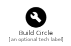

# BuildCircle


```text
material-4/Action/BuildCircle
```

```text
include('material-4/Action/BuildCircle')
```


| Illustration | BuildCircle |
| :---: | :---: |
|  |  |


## Sprites
The item provides the following sriptes:

- `<$BuildCircleXs>`
- `<$BuildCircleSm>`
- `<$BuildCircleMd>`
- `<$BuildCircleLg>`


## BuildCircle

### Load remotely
```plantuml
@startuml
' configures the library
!global $LIB_BASE_LOCATION="https://raw.githubusercontent.com/tmorin/plantuml-libs/master/distribution"

' loads the library's bootstrap
!include $LIB_BASE_LOCATION/bootstrap.puml

' loads the package bootstrap
include('material-4/bootstrap')

' loads the Item which embeds the element BuildCircle
include('material-4/Action/BuildCircle')

' renders the element
BuildCircle('BuildCircle', 'Build Circle', 'an optional tech label', 'an optional description')
@enduml
```

### Load locally
```plantuml
@startuml
' configures the library
!global $INCLUSION_MODE="local"
!global $LIB_BASE_LOCATION="../.."

' loads the library's bootstrap
!include $LIB_BASE_LOCATION/bootstrap.puml

' loads the package bootstrap
include('material-4/bootstrap')

' loads the Item which embeds the element BuildCircle
include('material-4/Action/BuildCircle')

' renders the element
BuildCircle('BuildCircle', 'Build Circle', 'an optional tech label', 'an optional description')
@enduml
```

