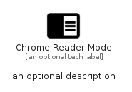

# ChromeReaderMode


```text
material-4/Action/ChromeReaderMode
```

```text
include('material-4/Action/ChromeReaderMode')
```


| Illustration | ChromeReaderMode |
| :---: | :---: |
|  |  |


## Sprites
The item provides the following sriptes:

- `<$ChromeReaderModeXs>`
- `<$ChromeReaderModeSm>`
- `<$ChromeReaderModeMd>`
- `<$ChromeReaderModeLg>`


## ChromeReaderMode

### Load remotely
```plantuml
@startuml
' configures the library
!global $LIB_BASE_LOCATION="https://raw.githubusercontent.com/tmorin/plantuml-libs/master/distribution"

' loads the library's bootstrap
!include $LIB_BASE_LOCATION/bootstrap.puml

' loads the package bootstrap
include('material-4/bootstrap')

' loads the Item which embeds the element ChromeReaderMode
include('material-4/Action/ChromeReaderMode')

' renders the element
ChromeReaderMode('ChromeReaderMode', 'Chrome Reader Mode', 'an optional tech label', 'an optional description')
@enduml
```

### Load locally
```plantuml
@startuml
' configures the library
!global $INCLUSION_MODE="local"
!global $LIB_BASE_LOCATION="../.."

' loads the library's bootstrap
!include $LIB_BASE_LOCATION/bootstrap.puml

' loads the package bootstrap
include('material-4/bootstrap')

' loads the Item which embeds the element ChromeReaderMode
include('material-4/Action/ChromeReaderMode')

' renders the element
ChromeReaderMode('ChromeReaderMode', 'Chrome Reader Mode', 'an optional tech label', 'an optional description')
@enduml
```

