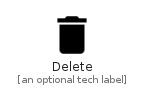

# Delete


```text
material-4/Action/Delete
```

```text
include('material-4/Action/Delete')
```


| Illustration | Delete |
| :---: | :---: |
|  |  |


## Sprites
The item provides the following sriptes:

- `<$DeleteXs>`
- `<$DeleteSm>`
- `<$DeleteMd>`
- `<$DeleteLg>`


## Delete

### Load remotely
```plantuml
@startuml
' configures the library
!global $LIB_BASE_LOCATION="https://raw.githubusercontent.com/tmorin/plantuml-libs/master/distribution"

' loads the library's bootstrap
!include $LIB_BASE_LOCATION/bootstrap.puml

' loads the package bootstrap
include('material-4/bootstrap')

' loads the Item which embeds the element Delete
include('material-4/Action/Delete')

' renders the element
Delete('Delete', 'Delete', 'an optional tech label', 'an optional description')
@enduml
```

### Load locally
```plantuml
@startuml
' configures the library
!global $INCLUSION_MODE="local"
!global $LIB_BASE_LOCATION="../.."

' loads the library's bootstrap
!include $LIB_BASE_LOCATION/bootstrap.puml

' loads the package bootstrap
include('material-4/bootstrap')

' loads the Item which embeds the element Delete
include('material-4/Action/Delete')

' renders the element
Delete('Delete', 'Delete', 'an optional tech label', 'an optional description')
@enduml
```

