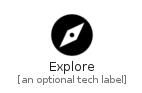

# Explore


```text
material-4/Action/Explore
```

```text
include('material-4/Action/Explore')
```


| Illustration | Explore |
| :---: | :---: |
|  |  |


## Sprites
The item provides the following sriptes:

- `<$ExploreXs>`
- `<$ExploreSm>`
- `<$ExploreMd>`
- `<$ExploreLg>`


## Explore

### Load remotely
```plantuml
@startuml
' configures the library
!global $LIB_BASE_LOCATION="https://raw.githubusercontent.com/tmorin/plantuml-libs/master/distribution"

' loads the library's bootstrap
!include $LIB_BASE_LOCATION/bootstrap.puml

' loads the package bootstrap
include('material-4/bootstrap')

' loads the Item which embeds the element Explore
include('material-4/Action/Explore')

' renders the element
Explore('Explore', 'Explore', 'an optional tech label', 'an optional description')
@enduml
```

### Load locally
```plantuml
@startuml
' configures the library
!global $INCLUSION_MODE="local"
!global $LIB_BASE_LOCATION="../.."

' loads the library's bootstrap
!include $LIB_BASE_LOCATION/bootstrap.puml

' loads the package bootstrap
include('material-4/bootstrap')

' loads the Item which embeds the element Explore
include('material-4/Action/Explore')

' renders the element
Explore('Explore', 'Explore', 'an optional tech label', 'an optional description')
@enduml
```

