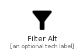

# FilterAlt


```text
material-4/Action/FilterAlt
```

```text
include('material-4/Action/FilterAlt')
```


| Illustration | FilterAlt |
| :---: | :---: |
|  |  |


## FilterAlt

### Load remotely
```plantuml
@startuml
' configures the library
!global $LIB_BASE_LOCATION="https://github.com/tmorin/plantuml-libs/distribution"

' loads the library's bootstrap
!include $LIB_BASE_LOCATION/bootstrap.puml

' loads the package bootstrap
include('material-4/bootstrap')

' loads the Item which embeds the element FilterAlt
include('material-4/Action/FilterAlt')

' renders the element
FilterAlt('FilterAlt', 'Filter Alt', 'an optional tech label')
@enduml
```

### Load locally
```plantuml
@startuml
' configures the library
!global $INCLUSION_MODE="local"
!global $LIB_BASE_LOCATION="../.."

' loads the library's bootstrap
!include $LIB_BASE_LOCATION/bootstrap.puml

' loads the package bootstrap
include('material-4/bootstrap')

' loads the Item which embeds the element FilterAlt
include('material-4/Action/FilterAlt')

' renders the element
FilterAlt('FilterAlt', 'Filter Alt', 'an optional tech label')
@enduml
```

