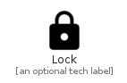

# Lock


```text
material-4/Action/Lock
```

```text
include('material-4/Action/Lock')
```


| Illustration | Lock |
| :---: | :---: |
|  |  |


## Lock

### Load remotely
```plantuml
@startuml
' configures the library
!global $LIB_BASE_LOCATION="https://raw.githubusercontent.com/tmorin/plantuml-libs/master/distribution"

' loads the library's bootstrap
!include $LIB_BASE_LOCATION/bootstrap.puml

' loads the package bootstrap
include('material-4/bootstrap')

' loads the Item which embeds the element Lock
include('material-4/Action/Lock')

' renders the element
Lock('Lock', 'Lock', 'an optional tech label', 'an optional description')
@enduml
```

### Load locally
```plantuml
@startuml
' configures the library
!global $INCLUSION_MODE="local"
!global $LIB_BASE_LOCATION="../.."

' loads the library's bootstrap
!include $LIB_BASE_LOCATION/bootstrap.puml

' loads the package bootstrap
include('material-4/bootstrap')

' loads the Item which embeds the element Lock
include('material-4/Action/Lock')

' renders the element
Lock('Lock', 'Lock', 'an optional tech label', 'an optional description')
@enduml
```

