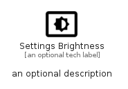

# SettingsBrightness


```text
material-4/Action/SettingsBrightness
```

```text
include('material-4/Action/SettingsBrightness')
```


| Illustration | SettingsBrightness |
| :---: | :---: |
|  |  |


## Sprites
The item provides the following sriptes:

- `<$SettingsBrightnessXs>`
- `<$SettingsBrightnessSm>`
- `<$SettingsBrightnessMd>`
- `<$SettingsBrightnessLg>`


## SettingsBrightness

### Load remotely
```plantuml
@startuml
' configures the library
!global $LIB_BASE_LOCATION="https://raw.githubusercontent.com/tmorin/plantuml-libs/master/distribution"

' loads the library's bootstrap
!include $LIB_BASE_LOCATION/bootstrap.puml

' loads the package bootstrap
include('material-4/bootstrap')

' loads the Item which embeds the element SettingsBrightness
include('material-4/Action/SettingsBrightness')

' renders the element
SettingsBrightness('SettingsBrightness', 'Settings Brightness', 'an optional tech label', 'an optional description')
@enduml
```

### Load locally
```plantuml
@startuml
' configures the library
!global $INCLUSION_MODE="local"
!global $LIB_BASE_LOCATION="../.."

' loads the library's bootstrap
!include $LIB_BASE_LOCATION/bootstrap.puml

' loads the package bootstrap
include('material-4/bootstrap')

' loads the Item which embeds the element SettingsBrightness
include('material-4/Action/SettingsBrightness')

' renders the element
SettingsBrightness('SettingsBrightness', 'Settings Brightness', 'an optional tech label', 'an optional description')
@enduml
```

