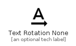

# TextRotationNone


```text
material-4/Action/TextRotationNone
```

```text
include('material-4/Action/TextRotationNone')
```


| Illustration | TextRotationNone |
| :---: | :---: |
|  |  |


## Sprites
The item provides the following sriptes:

- `<$TextRotationNoneXs>`
- `<$TextRotationNoneSm>`
- `<$TextRotationNoneMd>`
- `<$TextRotationNoneLg>`


## TextRotationNone

### Load remotely
```plantuml
@startuml
' configures the library
!global $LIB_BASE_LOCATION="https://raw.githubusercontent.com/tmorin/plantuml-libs/master/distribution"

' loads the library's bootstrap
!include $LIB_BASE_LOCATION/bootstrap.puml

' loads the package bootstrap
include('material-4/bootstrap')

' loads the Item which embeds the element TextRotationNone
include('material-4/Action/TextRotationNone')

' renders the element
TextRotationNone('TextRotationNone', 'Text Rotation None', 'an optional tech label', 'an optional description')
@enduml
```

### Load locally
```plantuml
@startuml
' configures the library
!global $INCLUSION_MODE="local"
!global $LIB_BASE_LOCATION="../.."

' loads the library's bootstrap
!include $LIB_BASE_LOCATION/bootstrap.puml

' loads the package bootstrap
include('material-4/bootstrap')

' loads the Item which embeds the element TextRotationNone
include('material-4/Action/TextRotationNone')

' renders the element
TextRotationNone('TextRotationNone', 'Text Rotation None', 'an optional tech label', 'an optional description')
@enduml
```

