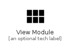

# ViewModule


```text
material-4/Action/ViewModule
```

```text
include('material-4/Action/ViewModule')
```


| Illustration | ViewModule |
| :---: | :---: |
|  |  |


## Sprites
The item provides the following sriptes:

- `<$ViewModuleXs>`
- `<$ViewModuleSm>`
- `<$ViewModuleMd>`
- `<$ViewModuleLg>`


## ViewModule

### Load remotely
```plantuml
@startuml
' configures the library
!global $LIB_BASE_LOCATION="https://raw.githubusercontent.com/tmorin/plantuml-libs/master/distribution"

' loads the library's bootstrap
!include $LIB_BASE_LOCATION/bootstrap.puml

' loads the package bootstrap
include('material-4/bootstrap')

' loads the Item which embeds the element ViewModule
include('material-4/Action/ViewModule')

' renders the element
ViewModule('ViewModule', 'View Module', 'an optional tech label', 'an optional description')
@enduml
```

### Load locally
```plantuml
@startuml
' configures the library
!global $INCLUSION_MODE="local"
!global $LIB_BASE_LOCATION="../.."

' loads the library's bootstrap
!include $LIB_BASE_LOCATION/bootstrap.puml

' loads the package bootstrap
include('material-4/bootstrap')

' loads the Item which embeds the element ViewModule
include('material-4/Action/ViewModule')

' renders the element
ViewModule('ViewModule', 'View Module', 'an optional tech label', 'an optional description')
@enduml
```

