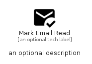

# MarkEmailRead


```text
material-4/Communication/MarkEmailRead
```

```text
include('material-4/Communication/MarkEmailRead')
```


| Illustration | MarkEmailRead |
| :---: | :---: |
|  |  |


## Sprites
The item provides the following sriptes:

- `<$MarkEmailReadXs>`
- `<$MarkEmailReadSm>`
- `<$MarkEmailReadMd>`
- `<$MarkEmailReadLg>`


## MarkEmailRead

### Load remotely
```plantuml
@startuml
' configures the library
!global $LIB_BASE_LOCATION="https://raw.githubusercontent.com/tmorin/plantuml-libs/master/distribution"

' loads the library's bootstrap
!include $LIB_BASE_LOCATION/bootstrap.puml

' loads the package bootstrap
include('material-4/bootstrap')

' loads the Item which embeds the element MarkEmailRead
include('material-4/Communication/MarkEmailRead')

' renders the element
MarkEmailRead('MarkEmailRead', 'Mark Email Read', 'an optional tech label', 'an optional description')
@enduml
```

### Load locally
```plantuml
@startuml
' configures the library
!global $INCLUSION_MODE="local"
!global $LIB_BASE_LOCATION="../.."

' loads the library's bootstrap
!include $LIB_BASE_LOCATION/bootstrap.puml

' loads the package bootstrap
include('material-4/bootstrap')

' loads the Item which embeds the element MarkEmailRead
include('material-4/Communication/MarkEmailRead')

' renders the element
MarkEmailRead('MarkEmailRead', 'Mark Email Read', 'an optional tech label', 'an optional description')
@enduml
```

