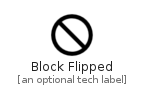

# BlockFlipped


```text
material-4/Content/BlockFlipped
```

```text
include('material-4/Content/BlockFlipped')
```


| Illustration | BlockFlipped |
| :---: | :---: |
|  |  |


## Sprites
The item provides the following sriptes:

- `<$BlockFlippedXs>`
- `<$BlockFlippedSm>`
- `<$BlockFlippedMd>`
- `<$BlockFlippedLg>`


## BlockFlipped

### Load remotely
```plantuml
@startuml
' configures the library
!global $LIB_BASE_LOCATION="https://raw.githubusercontent.com/tmorin/plantuml-libs/master/distribution"

' loads the library's bootstrap
!include $LIB_BASE_LOCATION/bootstrap.puml

' loads the package bootstrap
include('material-4/bootstrap')

' loads the Item which embeds the element BlockFlipped
include('material-4/Content/BlockFlipped')

' renders the element
BlockFlipped('BlockFlipped', 'Block Flipped', 'an optional tech label', 'an optional description')
@enduml
```

### Load locally
```plantuml
@startuml
' configures the library
!global $INCLUSION_MODE="local"
!global $LIB_BASE_LOCATION="../.."

' loads the library's bootstrap
!include $LIB_BASE_LOCATION/bootstrap.puml

' loads the package bootstrap
include('material-4/bootstrap')

' loads the Item which embeds the element BlockFlipped
include('material-4/Content/BlockFlipped')

' renders the element
BlockFlipped('BlockFlipped', 'Block Flipped', 'an optional tech label', 'an optional description')
@enduml
```

