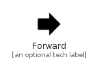

# Forward


```text
material-4/Content/Forward
```

```text
include('material-4/Content/Forward')
```


| Illustration | Forward |
| :---: | :---: |
|  |  |


## Forward

### Load remotely
```plantuml
@startuml
' configures the library
!global $LIB_BASE_LOCATION="https://raw.githubusercontent.com/tmorin/plantuml-libs/master/distribution"

' loads the library's bootstrap
!include $LIB_BASE_LOCATION/bootstrap.puml

' loads the package bootstrap
include('material-4/bootstrap')

' loads the Item which embeds the element Forward
include('material-4/Content/Forward')

' renders the element
Forward('Forward', 'Forward', 'an optional tech label')
@enduml
```

### Load locally
```plantuml
@startuml
' configures the library
!global $INCLUSION_MODE="local"
!global $LIB_BASE_LOCATION="../.."

' loads the library's bootstrap
!include $LIB_BASE_LOCATION/bootstrap.puml

' loads the package bootstrap
include('material-4/bootstrap')

' loads the Item which embeds the element Forward
include('material-4/Content/Forward')

' renders the element
Forward('Forward', 'Forward', 'an optional tech label')
@enduml
```

