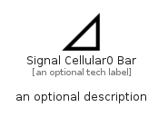

# SignalCellular0Bar


```text
material-4/Device/SignalCellular0Bar
```

```text
include('material-4/Device/SignalCellular0Bar')
```


| Illustration | SignalCellular0Bar |
| :---: | :---: |
|  |  |


## SignalCellular0Bar

### Load remotely
```plantuml
@startuml
' configures the library
!global $LIB_BASE_LOCATION="https://raw.githubusercontent.com/tmorin/plantuml-libs/master/distribution"

' loads the library's bootstrap
!include $LIB_BASE_LOCATION/bootstrap.puml

' loads the package bootstrap
include('material-4/bootstrap')

' loads the Item which embeds the element SignalCellular0Bar
include('material-4/Device/SignalCellular0Bar')

' renders the element
SignalCellular0Bar('SignalCellular0Bar', 'Signal Cellular0 Bar', 'an optional tech label')
@enduml
```

### Load locally
```plantuml
@startuml
' configures the library
!global $INCLUSION_MODE="local"
!global $LIB_BASE_LOCATION="../.."

' loads the library's bootstrap
!include $LIB_BASE_LOCATION/bootstrap.puml

' loads the package bootstrap
include('material-4/bootstrap')

' loads the Item which embeds the element SignalCellular0Bar
include('material-4/Device/SignalCellular0Bar')

' renders the element
SignalCellular0Bar('SignalCellular0Bar', 'Signal Cellular0 Bar', 'an optional tech label')
@enduml
```

