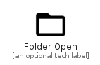

# FolderOpen


```text
material-4/File/FolderOpen
```

```text
include('material-4/File/FolderOpen')
```


| Illustration | FolderOpen |
| :---: | :---: |
|  |  |


## Sprites
The item provides the following sriptes:

- `<$FolderOpenXs>`
- `<$FolderOpenSm>`
- `<$FolderOpenMd>`
- `<$FolderOpenLg>`


## FolderOpen

### Load remotely
```plantuml
@startuml
' configures the library
!global $LIB_BASE_LOCATION="https://raw.githubusercontent.com/tmorin/plantuml-libs/master/distribution"

' loads the library's bootstrap
!include $LIB_BASE_LOCATION/bootstrap.puml

' loads the package bootstrap
include('material-4/bootstrap')

' loads the Item which embeds the element FolderOpen
include('material-4/File/FolderOpen')

' renders the element
FolderOpen('FolderOpen', 'Folder Open', 'an optional tech label', 'an optional description')
@enduml
```

### Load locally
```plantuml
@startuml
' configures the library
!global $INCLUSION_MODE="local"
!global $LIB_BASE_LOCATION="../.."

' loads the library's bootstrap
!include $LIB_BASE_LOCATION/bootstrap.puml

' loads the package bootstrap
include('material-4/bootstrap')

' loads the Item which embeds the element FolderOpen
include('material-4/File/FolderOpen')

' renders the element
FolderOpen('FolderOpen', 'Folder Open', 'an optional tech label', 'an optional description')
@enduml
```

