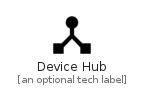

# DeviceHub


```text
material-4/Hardware/DeviceHub
```

```text
include('material-4/Hardware/DeviceHub')
```


| Illustration | DeviceHub |
| :---: | :---: |
|  |  |


## Sprites
The item provides the following sriptes:

- `<$DeviceHubXs>`
- `<$DeviceHubSm>`
- `<$DeviceHubMd>`
- `<$DeviceHubLg>`


## DeviceHub

### Load remotely
```plantuml
@startuml
' configures the library
!global $LIB_BASE_LOCATION="https://raw.githubusercontent.com/tmorin/plantuml-libs/master/distribution"

' loads the library's bootstrap
!include $LIB_BASE_LOCATION/bootstrap.puml

' loads the package bootstrap
include('material-4/bootstrap')

' loads the Item which embeds the element DeviceHub
include('material-4/Hardware/DeviceHub')

' renders the element
DeviceHub('DeviceHub', 'Device Hub', 'an optional tech label', 'an optional description')
@enduml
```

### Load locally
```plantuml
@startuml
' configures the library
!global $INCLUSION_MODE="local"
!global $LIB_BASE_LOCATION="../.."

' loads the library's bootstrap
!include $LIB_BASE_LOCATION/bootstrap.puml

' loads the package bootstrap
include('material-4/bootstrap')

' loads the Item which embeds the element DeviceHub
include('material-4/Hardware/DeviceHub')

' renders the element
DeviceHub('DeviceHub', 'Device Hub', 'an optional tech label', 'an optional description')
@enduml
```

