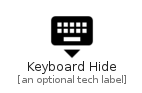

# KeyboardHide


```text
material-4/Hardware/KeyboardHide
```

```text
include('material-4/Hardware/KeyboardHide')
```


| Illustration | KeyboardHide |
| :---: | :---: |
|  |  |


## Sprites
The item provides the following sriptes:

- `<$KeyboardHideXs>`
- `<$KeyboardHideSm>`
- `<$KeyboardHideMd>`
- `<$KeyboardHideLg>`


## KeyboardHide

### Load remotely
```plantuml
@startuml
' configures the library
!global $LIB_BASE_LOCATION="https://raw.githubusercontent.com/tmorin/plantuml-libs/master/distribution"

' loads the library's bootstrap
!include $LIB_BASE_LOCATION/bootstrap.puml

' loads the package bootstrap
include('material-4/bootstrap')

' loads the Item which embeds the element KeyboardHide
include('material-4/Hardware/KeyboardHide')

' renders the element
KeyboardHide('KeyboardHide', 'Keyboard Hide', 'an optional tech label', 'an optional description')
@enduml
```

### Load locally
```plantuml
@startuml
' configures the library
!global $INCLUSION_MODE="local"
!global $LIB_BASE_LOCATION="../.."

' loads the library's bootstrap
!include $LIB_BASE_LOCATION/bootstrap.puml

' loads the package bootstrap
include('material-4/bootstrap')

' loads the Item which embeds the element KeyboardHide
include('material-4/Hardware/KeyboardHide')

' renders the element
KeyboardHide('KeyboardHide', 'Keyboard Hide', 'an optional tech label', 'an optional description')
@enduml
```

