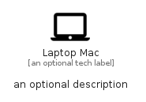

# LaptopMac


```text
material-4/Hardware/LaptopMac
```

```text
include('material-4/Hardware/LaptopMac')
```


| Illustration | LaptopMac |
| :---: | :---: |
|  |  |


## Sprites
The item provides the following sriptes:

- `<$LaptopMacXs>`
- `<$LaptopMacSm>`
- `<$LaptopMacMd>`
- `<$LaptopMacLg>`


## LaptopMac

### Load remotely
```plantuml
@startuml
' configures the library
!global $LIB_BASE_LOCATION="https://raw.githubusercontent.com/tmorin/plantuml-libs/master/distribution"

' loads the library's bootstrap
!include $LIB_BASE_LOCATION/bootstrap.puml

' loads the package bootstrap
include('material-4/bootstrap')

' loads the Item which embeds the element LaptopMac
include('material-4/Hardware/LaptopMac')

' renders the element
LaptopMac('LaptopMac', 'Laptop Mac', 'an optional tech label', 'an optional description')
@enduml
```

### Load locally
```plantuml
@startuml
' configures the library
!global $INCLUSION_MODE="local"
!global $LIB_BASE_LOCATION="../.."

' loads the library's bootstrap
!include $LIB_BASE_LOCATION/bootstrap.puml

' loads the package bootstrap
include('material-4/bootstrap')

' loads the Item which embeds the element LaptopMac
include('material-4/Hardware/LaptopMac')

' renders the element
LaptopMac('LaptopMac', 'Laptop Mac', 'an optional tech label', 'an optional description')
@enduml
```

