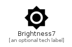

# Brightness7


```text
material-4/Image/Brightness7
```

```text
include('material-4/Image/Brightness7')
```


| Illustration | Brightness7 |
| :---: | :---: |
|  |  |


## Sprites
The item provides the following sriptes:

- `<$Brightness7Xs>`
- `<$Brightness7Sm>`
- `<$Brightness7Md>`
- `<$Brightness7Lg>`


## Brightness7

### Load remotely
```plantuml
@startuml
' configures the library
!global $LIB_BASE_LOCATION="https://raw.githubusercontent.com/tmorin/plantuml-libs/master/distribution"

' loads the library's bootstrap
!include $LIB_BASE_LOCATION/bootstrap.puml

' loads the package bootstrap
include('material-4/bootstrap')

' loads the Item which embeds the element Brightness7
include('material-4/Image/Brightness7')

' renders the element
Brightness7('Brightness7', 'Brightness7', 'an optional tech label', 'an optional description')
@enduml
```

### Load locally
```plantuml
@startuml
' configures the library
!global $INCLUSION_MODE="local"
!global $LIB_BASE_LOCATION="../.."

' loads the library's bootstrap
!include $LIB_BASE_LOCATION/bootstrap.puml

' loads the package bootstrap
include('material-4/bootstrap')

' loads the Item which embeds the element Brightness7
include('material-4/Image/Brightness7')

' renders the element
Brightness7('Brightness7', 'Brightness7', 'an optional tech label', 'an optional description')
@enduml
```

