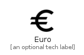

# Euro


```text
material-4/Image/Euro
```

```text
include('material-4/Image/Euro')
```


| Illustration | Euro |
| :---: | :---: |
|  |  |


## Sprites
The item provides the following sriptes:

- `<$EuroXs>`
- `<$EuroSm>`
- `<$EuroMd>`
- `<$EuroLg>`


## Euro

### Load remotely
```plantuml
@startuml
' configures the library
!global $LIB_BASE_LOCATION="https://raw.githubusercontent.com/tmorin/plantuml-libs/master/distribution"

' loads the library's bootstrap
!include $LIB_BASE_LOCATION/bootstrap.puml

' loads the package bootstrap
include('material-4/bootstrap')

' loads the Item which embeds the element Euro
include('material-4/Image/Euro')

' renders the element
Euro('Euro', 'Euro', 'an optional tech label', 'an optional description')
@enduml
```

### Load locally
```plantuml
@startuml
' configures the library
!global $INCLUSION_MODE="local"
!global $LIB_BASE_LOCATION="../.."

' loads the library's bootstrap
!include $LIB_BASE_LOCATION/bootstrap.puml

' loads the package bootstrap
include('material-4/bootstrap')

' loads the Item which embeds the element Euro
include('material-4/Image/Euro')

' renders the element
Euro('Euro', 'Euro', 'an optional tech label', 'an optional description')
@enduml
```

