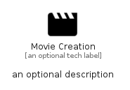

# MovieCreation


```text
material-4/Image/MovieCreation
```

```text
include('material-4/Image/MovieCreation')
```


| Illustration | MovieCreation |
| :---: | :---: |
|  |  |


## Sprites
The item provides the following sriptes:

- `<$MovieCreationXs>`
- `<$MovieCreationSm>`
- `<$MovieCreationMd>`
- `<$MovieCreationLg>`


## MovieCreation

### Load remotely
```plantuml
@startuml
' configures the library
!global $LIB_BASE_LOCATION="https://raw.githubusercontent.com/tmorin/plantuml-libs/master/distribution"

' loads the library's bootstrap
!include $LIB_BASE_LOCATION/bootstrap.puml

' loads the package bootstrap
include('material-4/bootstrap')

' loads the Item which embeds the element MovieCreation
include('material-4/Image/MovieCreation')

' renders the element
MovieCreation('MovieCreation', 'Movie Creation', 'an optional tech label', 'an optional description')
@enduml
```

### Load locally
```plantuml
@startuml
' configures the library
!global $INCLUSION_MODE="local"
!global $LIB_BASE_LOCATION="../.."

' loads the library's bootstrap
!include $LIB_BASE_LOCATION/bootstrap.puml

' loads the package bootstrap
include('material-4/bootstrap')

' loads the Item which embeds the element MovieCreation
include('material-4/Image/MovieCreation')

' renders the element
MovieCreation('MovieCreation', 'Movie Creation', 'an optional tech label', 'an optional description')
@enduml
```

