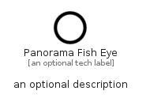

# PanoramaFishEye


```text
material-4/Image/PanoramaFishEye
```

```text
include('material-4/Image/PanoramaFishEye')
```


| Illustration | PanoramaFishEye |
| :---: | :---: |
|  |  |


## PanoramaFishEye

### Load remotely
```plantuml
@startuml
' configures the library
!global $LIB_BASE_LOCATION="https://raw.githubusercontent.com/tmorin/plantuml-libs/master/distribution"

' loads the library's bootstrap
!include $LIB_BASE_LOCATION/bootstrap.puml

' loads the package bootstrap
include('material-4/bootstrap')

' loads the Item which embeds the element PanoramaFishEye
include('material-4/Image/PanoramaFishEye')

' renders the element
PanoramaFishEye('PanoramaFishEye', 'Panorama Fish Eye', 'an optional tech label')
@enduml
```

### Load locally
```plantuml
@startuml
' configures the library
!global $INCLUSION_MODE="local"
!global $LIB_BASE_LOCATION="../.."

' loads the library's bootstrap
!include $LIB_BASE_LOCATION/bootstrap.puml

' loads the package bootstrap
include('material-4/bootstrap')

' loads the Item which embeds the element PanoramaFishEye
include('material-4/Image/PanoramaFishEye')

' renders the element
PanoramaFishEye('PanoramaFishEye', 'Panorama Fish Eye', 'an optional tech label')
@enduml
```

