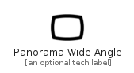

# PanoramaWideAngle


```text
material-4/Image/PanoramaWideAngle
```

```text
include('material-4/Image/PanoramaWideAngle')
```


| Illustration | PanoramaWideAngle |
| :---: | :---: |
|  |  |


## Sprites
The item provides the following sriptes:

- `<$PanoramaWideAngleXs>`
- `<$PanoramaWideAngleSm>`
- `<$PanoramaWideAngleMd>`
- `<$PanoramaWideAngleLg>`


## PanoramaWideAngle

### Load remotely
```plantuml
@startuml
' configures the library
!global $LIB_BASE_LOCATION="https://raw.githubusercontent.com/tmorin/plantuml-libs/master/distribution"

' loads the library's bootstrap
!include $LIB_BASE_LOCATION/bootstrap.puml

' loads the package bootstrap
include('material-4/bootstrap')

' loads the Item which embeds the element PanoramaWideAngle
include('material-4/Image/PanoramaWideAngle')

' renders the element
PanoramaWideAngle('PanoramaWideAngle', 'Panorama Wide Angle', 'an optional tech label', 'an optional description')
@enduml
```

### Load locally
```plantuml
@startuml
' configures the library
!global $INCLUSION_MODE="local"
!global $LIB_BASE_LOCATION="../.."

' loads the library's bootstrap
!include $LIB_BASE_LOCATION/bootstrap.puml

' loads the package bootstrap
include('material-4/bootstrap')

' loads the Item which embeds the element PanoramaWideAngle
include('material-4/Image/PanoramaWideAngle')

' renders the element
PanoramaWideAngle('PanoramaWideAngle', 'Panorama Wide Angle', 'an optional tech label', 'an optional description')
@enduml
```

