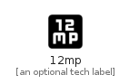

# _12Mp


```text
material-4/Image/_12Mp
```

```text
include('material-4/Image/_12Mp')
```


| Illustration | _12Mp |
| :---: | :---: |
|  |  |


## Sprites
The item provides the following sriptes:

- `<$_12MpXs>`
- `<$_12MpSm>`
- `<$_12MpMd>`
- `<$_12MpLg>`


## _12Mp

### Load remotely
```plantuml
@startuml
' configures the library
!global $LIB_BASE_LOCATION="https://raw.githubusercontent.com/tmorin/plantuml-libs/master/distribution"

' loads the library's bootstrap
!include $LIB_BASE_LOCATION/bootstrap.puml

' loads the package bootstrap
include('material-4/bootstrap')

' loads the Item which embeds the element _12Mp
include('material-4/Image/_12Mp')

' renders the element
_12Mp('12mp', '12mp', 'an optional tech label', 'an optional description')
@enduml
```

### Load locally
```plantuml
@startuml
' configures the library
!global $INCLUSION_MODE="local"
!global $LIB_BASE_LOCATION="../.."

' loads the library's bootstrap
!include $LIB_BASE_LOCATION/bootstrap.puml

' loads the package bootstrap
include('material-4/bootstrap')

' loads the Item which embeds the element _12Mp
include('material-4/Image/_12Mp')

' renders the element
_12Mp('12mp', '12mp', 'an optional tech label', 'an optional description')
@enduml
```

